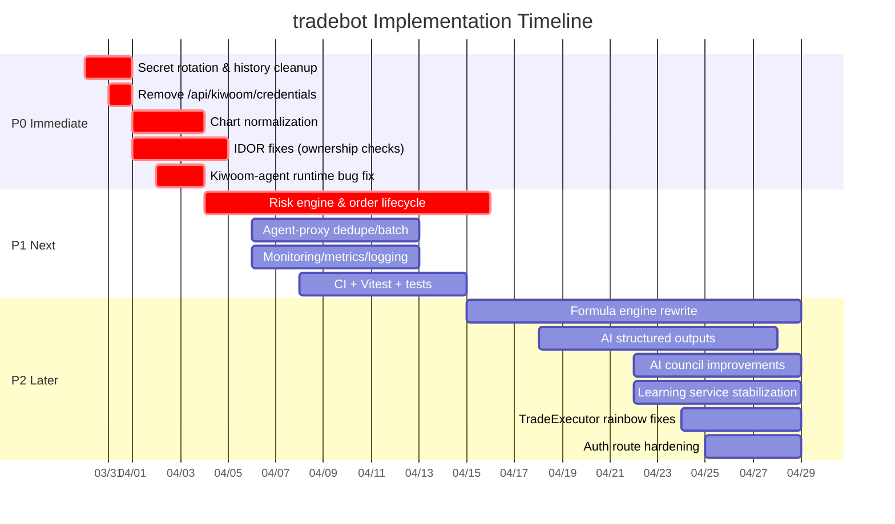

# Executive summary

이 응답은 `wsjung2023/tradebot`의 기존 분석 결과를 바탕으로, **각 이슈를 “바로 커밋 가능한 작업 지시서(.md)”**로 쪼개어 제공합니다. 현재 레포는 **React/Vite(클라이언트) + Express(TypeScript)(서버) + Postgres/Neon(Drizzle) + 집 PC 파이썬 에이전트(키움 REST/WS)** 조합이며, 외부 연동은 **키움 OpenAPI(토큰 발급/운영·모의 도메인 구조 포함)**, **네이버 뉴스 검색 API**, **OPENDART**, **OpenAI API**를 사용합니다. 키움 REST의 OAuth 토큰 발급 방식(POST `/oauth2/token`, `grant_type=client_credentials`, 운영/모의 도메인 분리)은 공식 문서에 정리되어 있고, 레포의 설계(에이전트 Job Queue)는 이 제약을 우회하려는 의도가 명확합니다. citeturn11search0

다만 “실거래 가능한 자동매매 봇”으로 가려면 **P0(즉시) 보안·정확도·권한 문제**를 먼저 정리해야 합니다. 특히 **시크릿이 커밋 히스토리에 노출된 경우엔 ‘삭제’보다 ‘폐기/회전(rotate)’가 1순위**라는 가이드가 GitHub 공식 문서에 명시되어 있으며, 히스토리 정리는 그 다음 단계입니다. citeturn14search0 또한 OpenAI의 JSON mode는 “유효 JSON”만 보장하고 “스키마 준수”는 보장하지 않으므로, 자동매매에 쓰려면 Structured Outputs(JSON schema, strict) 기반으로 계약을 강제하는 편이 안전합니다. citeturn10search6turn10search7

아래는 요청하신 대로 `/docs/tasks/` 아래에 커밋할 수 있는 **개별 작업 티켓**과, 이를 묶은 `index.md`(단계별 롤아웃 + Mermaid Gantt 포함)입니다.  
(각 티켓은: 제목/요약/우선순위/관련 파일·함수/원인/영향/수정 사양/코드 예시/테스트/롤아웃/소요·리스크/체크리스트/참고자료/브랜치·커밋/CI 스니펫 포함)

---

```md
<!-- File: docs/tasks/index.md -->

# tradebot 작업 티켓 인덱스 (Rollout Plan & Timeline)

## 가정(Assumptions) 및 설계 영향
- **Target Cloud Provider**: 미정  
  - Replit 유지 시: 고정 IP/운영 제약이 있어 “에이전트 기반” 유지가 현실적.
  - Docker + Cloud Run/ECS로 이전 시: 표준화/관측성/비용 최적화 용이. 고정 IP가 필요하면 NAT/고정 egress 설계 필요.
- **Expected QPS**: 미정  
  - 1인/저QPS면 DB 폴링 구조도 단기 가능. 다중 사용자/WS 구독 심볼 증가 시 dedupe/batch/이벤트화 필요.
- **Dataset Size**: 미정  
  - 일봉/주봉 위주면 Postgres 단독으로 충분. 분봉/틱 확장 시 시계열/캐시 계층 고려 필요.
- **Number of Users**: 미정  
  - 1인 운영이라도 미래 확장 대비 IDOR/권한 모델은 지금 고쳐두는 것이 비용이 가장 낮음.

## Executive Summary (짧게)
- P0(즉시): **시크릿 회전+히스토리 정리**, **/api/kiwoom/credentials 제거**, **차트 정규화(date ASC) 단일화**, **IDOR/소유권 검증**, **kiwoom-agent routes 런타임 에러 수정**
- P1(다음): **Risk Engine + 주문 수명주기**, **Agent-proxy/MarketDataHub dedupe+batch**, **관측성(메트릭/로그/알림)**, **Vitest/CI**
- P2(이후): **Formula 파서/이벨류에이터 전면 개선**, **AI Structured Outputs**, **AI Council/학습 로직 버그 수정**, **OAuth 라우트 정리**, **장시간/휴장일 개선**

## 티켓 목록
> 경로는 레포 기준 상대경로이며, 아래 파일들을 `/docs/tasks/`에 추가 커밋하세요.

| ID | Priority | Ticket File | 요약 | 제안 브랜치 | 커밋 메시지(요약) |
|---|---|---|---|---|---|
| TSK-P0-001 | P0 | docs/tasks/TSK-P0-001-secret-rotation.md | 시크릿 회전 + git 히스토리 정리(.replit 등) | hotfix/secret-rotation | chore(security): rotate secrets and purge history |
| TSK-P0-002 | P0 | docs/tasks/TSK-P0-002-remove-kiwoom-credentials.md | `/api/kiwoom/credentials` 제거 | hotfix/remove-kiwoom-credentials | fix(security): remove kiwoom credentials endpoint |
| TSK-P0-003 | P0 | docs/tasks/TSK-P0-003-chart-normalization.md | 차트 정렬(date ASC) 단일화 | fix/chart-normalization | fix(data): normalize chart ordering by date |
| TSK-P0-004 | P0 | docs/tasks/TSK-P0-004-idor-fixes.md | IDOR/소유권 검증(Watchlist/Alert/AI Recommendations/Order 등) | fix/authz-ownership | fix(authz): enforce ownership checks |
| TSK-P0-005 | P0 | docs/tasks/TSK-P0-005-kiwoom-agent-runtime-bug.md | kiwoom-agent routes의 undefined 메서드 호출 등 런타임 버그 수정 | fix/kiwoom-agent-runtime | fix(agent): fix job status polling runtime errors |
| TSK-P1-101 | P1 | docs/tasks/TSK-P1-101-risk-engine-order-lifecycle.md | Risk Engine + 주문 수명주기 + 멱등성 + Kill switch | feat/risk-engine | feat(trading): add risk engine and order lifecycle |
| TSK-P1-102 | P1 | docs/tasks/TSK-P1-102-agent-proxy-dedupe-event.md | agent-proxy 폴링 개선(dedupe/batch → 이벤트화 옵션) | perf/agent-proxy-dedupe | perf(agent): dedupe and batch agent jobs |
| TSK-P1-103 | P1 | docs/tasks/TSK-P1-103-monitoring-metrics-logging.md | Prometheus 메트릭 + 구조화 로그 + 알림/대시보드 | feat/observability | feat(obs): add metrics and structured logging |
| TSK-P1-104 | P1 | docs/tasks/TSK-P1-104-ci-vitest.md | Vitest 도입 + CI(GitHub Actions) + 회귀/통합/E2E 스모크 | chore/ci-vitest | test(ci): add vitest and CI pipeline |
| TSK-P2-201 | P2 | docs/tasks/TSK-P2-201-formula-parser.md | Formula tokenizer/parser/evaluator 개선(<=, valuewhen 등) | refactor/formula-engine | refactor(formula): rewrite parser/evaluator |
| TSK-P2-202 | P2 | docs/tasks/TSK-P2-202-ai-structured-outputs.md | AI Structured Outputs(JSON schema strict) + 검증/재시도 | feat/ai-structured-outputs | feat(ai): enforce schema with structured outputs |
| TSK-P2-203 | P2 | docs/tasks/TSK-P2-203-ai-council-improvements.md | AI Council persona/입력 분화 + 합의 로직 개선 | feat/ai-council | feat(ai): improve council personas and consensus |
| TSK-P2-204 | P2 | docs/tasks/TSK-P2-204-learning-service-bugs.md | LearningService 버그(중첩 필드) + NaN 방지 + 테스트 | fix/learning-service | fix(learning): correct condition paths and stabilize weights |
| TSK-P2-205 | P2 | docs/tasks/TSK-P2-205-trade-executor-rainbow.md | TradeExecutor Rainbow 라인 스케일/설정 반영 | fix/trade-executor-rainbow | fix(trading): correct rainbow line mapping and weights |
| TSK-P2-206 | P2 | docs/tasks/TSK-P2-206-auth-route-hardening.md | 사용하지 않는 OAuth 라우트 가드/제거 + allowlist 등록 단계 강화 | fix/auth-hardening | fix(auth): harden oauth routes and registration |

## 롤아웃 단계(Phases)
### P0 (즉시: 24~48시간)
- TSK-P0-001 → TSK-P0-002 → TSK-P0-003 → TSK-P0-004 → TSK-P0-005
- 목표: **시크릿/권한/정확도/런타임 안정성**을 먼저 고정

### P1 (다음: 1~2주)
- TSK-P1-101, TSK-P1-102, TSK-P1-103, TSK-P1-104
- 목표: **실거래 전 안전장치 + 성능 + 관측성 + CI**

### P2 (이후: 2~6주)
- TSK-P2-201 ~ TSK-P2-206
- 목표: **수식 엔진/AI 계약/학습 안정화/인증 정리**

## Mermaid Gantt (예시 일정)
> 시작일은 2026-03-30(월) 기준 예시. 실제 일정은 리소스/우선순위에 맞게 조정.


```

---

```md
<!-- File: docs/tasks/TSK-P0-001-secret-rotation.md -->

# [TSK-P0-001] 시크릿 회전(rotate) + git 히스토리 정리 + 재발 방지

## 요약
레포에 민감 정보가 커밋된 정황(`/.replit`)이 있으므로 **즉시 시크릿을 폐기/재발급(rotate)**하고, 필요 시 **git 히스토리에서 제거**합니다. 이후 재발 방지를 위한 훅/스캐너/CI를 추가합니다.

- 우선순위: **P0**
- 예상 소요: **중**
- 리스크: **높음**(협업자/포크/캐시로 재오염 가능)

## 관련 파일/라인(가능하면 경로/함수)
- `/.replit` (민감값 포함 정황)
- `/.gitignore`
- `server/index.ts` (`SESSION_SECRET` 사용)
- `server/routes/kiwoom-agent.routes.ts` (`AGENT_KEY` 기반 인증)

## 문제 설명(원인)
- `.replit` 같은 런타임 설정 파일이 버전 관리에 포함되면서 키움 AppKey/Secret, AGENT_KEY 등 민감 값이 커밋 히스토리에 포함된 정황이 있음.
- 민감값이 한번이라도 커밋 히스토리에 들어가면 단순 파일 삭제만으로는 충분하지 않음(기존 커밋/포크/클론에 남음).

## 영향도
- 키/시크릿 탈취 시: API 오남용/계정 악용/실거래 피해 가능.
- 보안 사고 대응 비용이 급증하며, 이후 기능 개발의 전제가 무너짐.

## 구체적 수정 설계/사양
### 1) 즉시 조치(오늘)
- (필수) 커밋된 적 있는 시크릿 전부 **revoke/rotate**
  - KIWOOM_APP_KEY_*, KIWOOM_APP_SECRET_*
  - AGENT_KEY
  - SESSION_SECRET
  - NAVER_CLIENT_ID/SECRET, DART_API_KEY, OPENAI_API_KEY 등
- 운영/모의 키가 분리되어 있으면 둘 다 교체.

### 2) 레포 정리
- `.replit`를 `.gitignore`에 추가하고 레포에서 제거.
- 로컬/배포 환경에서는 시크릿을 “환경변수/시크릿 스토어”로만 주입하도록 표준화.

### 3) 히스토리 정리(필요 시)
- `git-filter-repo`로 `.replit` 및 유출된 시크릿 문자열을 히스토리에서 제거.
- 히스토리 rewrite 시 협업자/클론/PR 영향 범위를 문서화하고 공지.

### 4) 재발 방지
- pre-commit: gitleaks(또는 git-secrets) 훅 추가
- CI: PR 시 gitleaks 스캔 추가
- GitHub 설정: Secret scanning / Push protection 활성화(가능하면)

## 코드 변경 예시 또는 의사코드
### .gitignore
```diff
+.replit
+.env
+.env.*
```

### 히스토리에서 파일 제거(예시 커맨드)
```bash
# file path 제거
git filter-repo --sensitive-data-removal --invert-paths --path .replit

# 또는 특정 문자열 패턴 치환(replace-text) 방식도 병행 가능
# passwords.txt에 "old_secret==>***REMOVED***" 형태로 작성
git filter-repo --sensitive-data-removal --replace-text ../passwords.txt
```

## 테스트 케이스(단위/통합/E2E)
- 단위: 해당 없음
- 통합:
  - 배포 환경에 시크릿 주입 후 `npm run build` / 서버 부팅 성공
  - 에이전트가 `AGENT_KEY`로 정상 폴링/업로드 가능한지
- E2E:
  - 로그인 → watchlist 조회 → 가격 조회 → 에이전트 job 처리까지 정상 flow 확인

## 배포/롤아웃 절차(백워드 호환성, 마이그레이션)
1. 시크릿 rotate → 배포 환경 변수 갱신
2. `.replit` 제거 + `.gitignore` 반영 → 배포
3. (필요 시) 히스토리 rewrite → 강제 푸시
4. 협업자/클론 사용자들에게 “재클론 또는 정리 절차” 안내
5. gitleaks/secret scanning 적용 확인

## 예상 소요 및 리스크
- 소요: 중(히스토리 정리 포함) / 낮음(rotate+ignore만)
- 리스크: 높음(재오염, 협업자 브랜치 충돌, PR diff 깨짐)

## 검증 체크리스트
- [ ] 모든 시크릿 rotate 완료(운영/모의 포함)
- [ ] `.replit`이 git에 더 이상 추적되지 않음
- [ ] CI/훅이 시크릿 푸시를 차단/감지
- [ ] 서버/에이전트 기능 정상

## 관련 참고자료(링크)
- GitHub Docs: Removing sensitive data from a repository  
  - https://docs.github.com/articles/remove-sensitive-data

## 제안 Git 브랜치명 / 커밋 메시지
- 브랜치: `hotfix/secret-rotation`
- 커밋: `chore(security): rotate secrets and purge history`

## GitHub Actions 스니펫(관련 시)
```yaml
# .github/workflows/secret-scan.yml (예시)
name: secret-scan
on: [pull_request]
jobs:
  gitleaks:
    runs-on: ubuntu-latest
    steps:
      - uses: actions/checkout@v4
      - uses: gitleaks/gitleaks-action@v2
```
```

---

```md
<!-- File: docs/tasks/TSK-P0-002-remove-kiwoom-credentials.md -->

# [TSK-P0-002] `/api/kiwoom/credentials` 엔드포인트 제거(Secret 브라우저 전송 금지)

## 요약
서버가 키움 AppKey/Secret을 브라우저로 내려주는 API(`/api/kiwoom/credentials`)는 구조적으로 위험합니다. 즉시 제거하고, 키움 호출은 **서버 내부 또는 집 PC 에이전트 경유로만** 수행하도록 정리합니다.

- 우선순위: **P0**
- 예상 소요: **낮음~중**
- 리스크: **중**(프론트에서 폴백 로직을 기대할 가능성)

## 관련 파일/라인(가능하면 경로/함수)
- `server/routes/account.routes.ts`
  - route: `GET /api/kiwoom/credentials`
- `client/src/*` (해당 API를 호출하는 컴포넌트/훅이 있으면 제거)

## 문제 설명(원인)
- “클라이언트 폴백” 목적으로 Secret을 반환하는 엔드포인트가 존재.
- 브라우저는 XSS/확장프로그램/프록시/로그로 비밀이 새기 쉬운 환경.

## 영향도
- 시크릿 유출 시 키움 API 악용 가능.
- P0 보안 리스크.

## 구체적 수정 설계/사양
1. `/api/kiwoom/credentials` 삭제(또는 410 Gone로 변경 후 단계적 제거)
2. 프론트에서 해당 API 호출 코드 제거
3. 잔고/시세/주문 등 키움 연동은 다음 중 하나로 통일:
   - **집 PC 에이전트 경유**(권장)
   - 서버 직접 호출로 가려면 고정IP/접근제어/시크릿 스토어 필수(단, 본 레포는 agent 기반이 이미 존재)

## 코드 변경 예시 또는 의사코드
```diff
- app.get("/api/kiwoom/credentials", isAuthenticated, (req, res) => {
-   res.json({ appKey: process.env.KIWOOM_APP_KEY, appSecret: process.env.KIWOOM_APP_SECRET });
- });
+ // removed: never send broker secrets to client
```

## 테스트 케이스(단위/통합/E2E)
- 단위: 라우터 테스트(404/410)
- 통합:
  - 서버 부팅 후 `/api/kiwoom/credentials`가 존재하지 않는지
  - 대체 경로(에이전트)를 통해 잔고/시세가 정상인지
- E2E(Playwright):
  - 로그인 후 “계좌/시세” 화면 진입이 깨지지 않는지(요청 실패 없는지)

## 배포/롤아웃 절차(백워드 호환성, 마이그레이션)
- 1차 배포: `/api/kiwoom/credentials`를 410으로 응답 + 프론트에서 호출 제거
- 2차 배포: 완전 삭제(404)
- 배포 전: 에이전트 경유 기능이 정상인지 확인(최소 시세 조회)

## 예상 소요 및 리스크
- 소요: 낮음(라우트만)~중(프론트 폴백 제거)
- 리스크: 중(의존 UI가 있을 수 있음)

## 검증 체크리스트
- [ ] 브라우저로 키움 Secret이 내려가지 않음
- [ ] 프론트에서 해당 API 호출 없음
- [ ] 계좌/시세 핵심 플로우 정상

## 관련 참고자료(링크)
- (내부 정책) “브라우저로 시크릿 전송 금지” 보안 원칙

## 제안 Git 브랜치명 / 커밋 메시지
- 브랜치: `hotfix/remove-kiwoom-credentials`
- 커밋: `fix(security): remove kiwoom credentials endpoint`

## GitHub Actions 스니펫(관련 시)
```yaml
# 기존 CI에서 typecheck/build만 통과하면 충분
- run: npm run check
- run: npm run build
```
```

---

```md
<!-- File: docs/tasks/TSK-P0-003-chart-normalization.md -->

# [TSK-P0-003] 차트 데이터 정규화(date ASC) 단일화 + Rainbow/BackAttack 결과 일관성 확보

## 요약
차트 데이터가 모듈별로 “최신→과거” 또는 “과거→최신” 가정을 다르게 사용하여 시그널이 왜곡될 수 있습니다. `UserKiwoomService.getChart()`에서 **date ASC(과거→최신)**로 강제 정렬하고, 하위 모듈은 이를 신뢰하도록 통일합니다.

- 우선순위: **P0**
- 예상 소요: **중**
- 리스크: **높음**(기존 결과와 달라질 수 있으나, 기존이 틀렸을 확률이 큼)

## 관련 파일/라인(가능하면 경로/함수)
- `server/services/user-kiwoom.service.ts`
  - `getChart(...)`
- `server/routes/trading.routes.ts`
  - `/api/trading/rainbow-lines`, `/api/trading/chart`
- `server/routes/rainbow.ts`
  - `/api/rainbow/analyze`
- `server/routes/autotrading.routes.ts`
  - `/api/auto-trading/backattack-scan`
- `server/services/trade-executor.service.ts`
  - `calculateRainbowSignal(...)`, `evaluateStock(...)`

## 문제 설명(원인)
- `reverse()`를 적용하는 곳과 그렇지 않은 곳이 혼재.
- 에이전트/키움 API 원본 정렬을 명시적으로 정규화하지 않음.

## 영향도
- 동일 종목/동일 기간인데도 엔드포인트/작업에 따라 매수/매도 판단이 바뀔 수 있음.
- 학습 데이터(tradingPerformance) 오염.

## 구체적 수정 설계/사양
1. `UserKiwoomService.getChart()`가 반환하는 아이템을 **항상 date ASC**로 정렬
2. 모든 Rainbow/BackAttack 분석은 “date ASC 입력”을 전제로 구현
3. 본 변경 후 회귀검증:
   - 같은 종목으로 `/api/trading/rainbow-lines` vs `/api/rainbow/analyze`가 같은 핵심값(CL/currentPosition 등)을 내는지

## 코드 변경 예시 또는 의사코드
```ts
// server/services/user-kiwoom.service.ts
function normalizeChartByDateAsc<T extends { date?: string }>(items: T[]): T[] {
  return [...items].sort((a, b) => (a.date ?? "").localeCompare(b.date ?? ""));
}

async getChart(userId: string, stockCode: string, period="D", count=100) {
  const raw = await this.callViaAgentOrLegacy(...);
  const normalized = normalizeChartByDateAsc(raw);
  return normalized;
}
```

## 테스트 케이스(단위/통합/E2E)
- 단위:
  - `normalizeChartByDateAsc`가 최신순/랜덤 입력을 date ASC로 만드는지
- 통합:
  - 동일 종목 호출 시 3개 엔드포인트 결과가 일관되는지(스냅샷 테스트)
- E2E:
  - UI에서 차트/레인보우 분석 화면이 서로 모순되는 메시지를 내지 않는지

## 배포/롤아웃 절차(백워드 호환성, 마이그레이션)
- 기능 플래그(예: `CHART_NORMALIZE_V1=true`)로 단계적 적용 권장
- 1단계: 로그에 `firstDate/lastDate` 및 정렬 여부 출력
- 2단계: 일괄 적용 후 이전/이후 비교 리포트 작성

## 예상 소요 및 리스크
- 소요: 중
- 리스크: 높음(기존 신호/알림/자동매매 결과가 달라질 수 있음)

## 검증 체크리스트
- [ ] getChart 반환이 항상 date ASC인지
- [ ] rainbow/analyze/backattack-scan 결과가 상호 일관되는지
- [ ] 자동매매(Shadow)에서 급격한 시그널 변화가 없는지(혹은 합리적 변화인지)

## 관련 참고자료(링크)
- (내부) 차트 시계열 표준: “입력은 항상 과거→최신”

## 제안 Git 브랜치명 / 커밋 메시지
- 브랜치: `fix/chart-normalization`
- 커밋: `fix(data): normalize chart ordering by date`

## GitHub Actions 스니펫(관련 시)
```yaml
- run: npm run check
- run: npm run build
- run: npm run test:unit
```
```

---

```md
<!-- File: docs/tasks/TSK-P0-004-idor-fixes.md -->

# [TSK-P0-004] IDOR/소유권 검증 누락 수정(Watchlist/Alert/AI Recommendations/Order 등)

## 요약
일부 API가 리소스 `id`만으로 delete/read를 수행하여, 다중 사용자 환경에서 **타 사용자 데이터 접근/삭제**가 가능해질 수 있습니다. 라우트와 storage 계층 모두에서 **(userId, resourceId)** 기반의 소유권 검증을 강제합니다.

- 우선순위: **P0**
- 예상 소요: **중**
- 리스크: **높음**(보안)

## 관련 파일/라인(가능하면 경로/함수)
- `server/routes/watchlist.routes.ts`
  - `DELETE /api/watchlist/:id`
  - `DELETE /api/alerts/:id`
- `server/routes/ai.routes.ts`
  - `GET /api/ai/models/:modelId/recommendations`
- `server/routes/trading.routes.ts`
  - 주문 생성/계좌 연동(`POST /api/trading/orders` 등, accountId 검증 시점)
- `server/storage/postgres-core.storage.ts`
  - `deleteWatchlistItem(id)`
  - `deleteAlert(id)`
  - `getRecommendations(modelId)` 등

## 문제 설명(원인)
- delete/update가 “id 단독”으로 실행되고 userId 검증이 누락된 곳이 있음.
- 일부 흐름은 “리소스를 먼저 생성해버린 뒤” 계좌 검사(ownership) 수행.

## 영향도
- 타 사용자 데이터 삭제/열람 가능성(향후 서비스 확장 시 치명).
- 감사/컴플라이언스 측면에서도 데이터 무결성 문제가 발생.

## 구체적 수정 설계/사양
1. 라우트 레벨: 삭제/조회 전 반드시 `resource.userId === currentUser.id` 검증
2. 스토리지 레벨: `deleteWatchlistItem(userId, id)` 형태로 시그니처 변경  
   - SQL where에 userId 포함하여 방어(2중 안전장치)
3. 주문 생성 플로우:
   - `accountId`가 현재 사용자 소유인지 먼저 검증 → 그 다음 order 레코드 생성

## 코드 변경 예시 또는 의사코드
```ts
// watchlist.routes.ts (예시)
const userId = getCurrentUser(req)!.id;
const id = Number(req.params.id);
const item = await storage.getWatchlistItemById(id);
if (!item || item.userId !== userId) return res.status(404).json({error:"not found"});
await storage.deleteWatchlistItem(userId, id); // 시그니처 변경 권장
```

```ts
// ai.routes.ts (예시)
const model = await storage.getAiModelById(Number(req.params.modelId));
if (!model || model.userId !== userId) return res.status(404).json({error:"not found"});
return res.json(await storage.getRecommendationsForModel(userId, model.id));
```

## 테스트 케이스(단위/통합/E2E)
- 단위:
  - storage 메서드가 userId 조건을 포함하는지(쿼리/스냅샷)
- 통합:
  - User A가 만든 watchlist/alert/model을 User B가 삭제/조회 시 404/403
  - 주문 생성 시 타 사용자 accountId로 실패하며 DB에 주문 레코드가 남지 않는지
- E2E:
  - 2계정 세션으로 “서로의 리소스 접근” 시나리오 자동화

## 배포/롤아웃 절차(백워드 호환성, 마이그레이션)
- 1단계: 라우트 레벨 선검증으로 즉시 완화
- 2단계: storage 시그니처 변경(컴파일/호출부 일괄 수정)
- 3단계(선택): DB 레벨에서 userId+id 인덱스/제약 강화

## 예상 소요 및 리스크
- 소요: 중
- 리스크: 높음(수정 범위가 넓고 테스트 필요)

## 검증 체크리스트
- [ ] watchlist/alert/model recommendations가 userId 기반으로 제한됨
- [ ] 주문 생성에서 account ownership 선검증됨
- [ ] 회귀: 정상 사용자 플로우는 모두 유지됨

## 관련 참고자료(링크)
- (내부) OWASP Broken Access Control 대응 원칙

## 제안 Git 브랜치명 / 커밋 메시지
- 브랜치: `fix/authz-ownership`
- 커밋: `fix(authz): enforce ownership checks`

## GitHub Actions 스니펫(관련 시)
```yaml
- run: npm run check
- run: npm run test:unit
- run: npm run test:integration
```
```

---

```md
<!-- File: docs/tasks/TSK-P0-005-kiwoom-agent-runtime-bug.md -->

# [TSK-P0-005] kiwoom-agent routes 런타임 버그 수정(undefined 메서드/상태 업데이트 안정화)

## 요약
`server/routes/kiwoom-agent.routes.ts`에서 storage에 존재하지 않는 메서드 호출(예: `storage.getKiwoomJob(...)`) 정황이 있어 런타임 에러가 발생할 수 있습니다. 에이전트 self-update/system-status 등 핵심 운영 기능이 깨질 수 있으므로 즉시 정리합니다.

- 우선순위: **P0**
- 예상 소요: **낮음~중**
- 리스크: **중**(에이전트 운영 플로우 영향)

## 관련 파일/라인(가능하면 경로/함수)
- `server/routes/kiwoom-agent.routes.ts`
  - job 상태 폴링/업데이트 로직 (selfUpdate / systemStatus / etc)
- `server/storage/interface.ts`
- `server/storage/postgres-core.storage.ts`
  - `getKiwoomJobByIdInternal(...)`, `getKiwoomJobStatus(...)` 등 실제 존재 메서드 확인

## 문제 설명(원인)
- 라우트 코드가 `storage.getKiwoomJob(id)` 같은 메서드를 호출하지만, 인터페이스/구현에는 다른 이름으로 존재.
- JS 런타임에서 undefined 호출 시 즉시 예외가 발생.

## 영향도
- 에이전트가 job 결과를 올려도 서버가 처리 실패할 수 있음.
- 운영 중 “에이전트가 죽은 것처럼 보이거나”, self-update가 실패하는 등 장애 유발.

## 구체적 수정 설계/사양
1. `storage.getKiwoomJob(...)` 호출부를 실제 메서드로 교체:
   - 내부용이라면 `getKiwoomJobByIdInternal(id)` 사용
   - 상태만 필요하면 `getKiwoomJobStatus(id)` 사용
2. 공통 함수로 정리:
   - `await waitForJobDone(jobId, timeoutMs)` 형태로 중복 제거
3. 실패 케이스:
   - timeout 시 명확한 에러 응답 + job status 유지/정리 정책 정의

## 코드 변경 예시 또는 의사코드
```ts
// kiwoom-agent.routes.ts (개념)
async function waitForCompletion(jobId:number, timeoutMs=15000){
  const start = Date.now();
  while (Date.now() - start < timeoutMs){
    const status = await storage.getKiwoomJobStatus(jobId);
    if (!status) throw new Error("job not found");
    if (status.status === "done") return status.result;
    if (status.status === "error") throw new Error(status.error ?? "job failed");
    await sleep(500);
  }
  throw new Error("timeout");
}
```

## 테스트 케이스(단위/통합/E2E)
- 단위:
  - waitForCompletion가 done/error/timeout을 올바르게 처리
- 통합:
  - mock job 레코드를 만들어 status 전이를 시뮬레이션
- E2E:
  - 에이전트가 self-update job을 가져가고 결과 업로드 후 서버가 완료 응답 반환

## 배포/롤아웃 절차(백워드 호환성, 마이그레이션)
- 서버 먼저 배포(라우트 안정화)
- 에이전트는 기존과 호환 유지(서버 API 계약 변화 없음)

## 예상 소요 및 리스크
- 소요: 낮음~중
- 리스크: 중(운영 플로우 영향 → staging에서 에이전트로 검증 필요)

## 검증 체크리스트
- [ ] self-update/system-status 관련 API가 런타임 예외 없이 동작
- [ ] job 완료/실패/timeout이 명확히 관측됨(로그/응답)

## 관련 참고자료(링크)
- (내부) job queue 상태 머신 표준

## 제안 Git 브랜치명 / 커밋 메시지
- 브랜치: `fix/kiwoom-agent-runtime`
- 커밋: `fix(agent): fix job status polling runtime errors`

## GitHub Actions 스니펫(관련 시)
```yaml
- run: npm run check
- run: npm run test:unit
```
```

---

```md
<!-- File: docs/tasks/TSK-P1-101-risk-engine-order-lifecycle.md -->

# [TSK-P1-101] Risk Engine + 주문 수명주기(Order Lifecycle) + 멱등성(Idempotency) + Kill Switch

## 요약
자동매매가 실거래로 갈 수 있도록 “안전장치”를 구현합니다.
- Pre-trade Risk Gate(일손실/횟수/중복/쿨다운/포지션/가용현금)
- 주문 수명주기(created→submitted→accepted→filled/partial→canceled/rejected)
- 멱등성 키로 중복 주문 방지
- Kill Switch(전역/모델/계좌 단위)

- 우선순위: **P1**
- 예상 소요: **높음**
- 리스크: **높음**(실거래 안정성 핵심)

## 관련 파일/라인(가능하면 경로/함수)
- `server/services/trade-executor.service.ts`
  - `evaluateStock(...)`, `placeTrade(...)`, `calculateRainbowSignal(...)`
- `server/auto-trading-worker.ts`
  - 크론 실행/모델 순회/조건검색 결과 처리
- `shared/schema.ts`
  - `orders`, `trades`, `tradingPerformance`, `userSettings`, `aiModels` 등
- `server/storage/postgres-core.storage.ts`
  - order/trade CRUD

## 문제 설명(원인)
- 현재 주문 실행이 단순 호출에 가까워 손실 폭주/중복/체결 미확인 등 실전 위험이 큼.
- 학습 데이터도 체결 기반이 아니라 “의사결정 기반”으로 오염될 여지가 있음.

## 영향도
- 과매매/오주문/손실 확대로 금전 피해 가능.
- 사고 발생 시 원인 추적/롤백 불가.

## 구체적 수정 설계/사양
### 1) Risk Engine(Pre-trade Gate)
- 입력:
  - 사용자 설정(일손실 한도, 일 거래횟수, 종목당 포지션 한도, 쿨다운)
  - 계좌 상태(가용현금, 평가금액)
  - 오픈 주문/포지션
- 출력:
  - `allowed: boolean`
  - `reasons: string[]`
  - `limitsSnapshot`(검증 근거)

### 2) Order Lifecycle 확장
- `orders.status`에 최소 상태 추가:
  - created/submitted/accepted/filled/partial/rejected/canceled/expired
- broker 응답 저장:
  - brokerOrderId, submittedAt, acceptedAt, filledAt, rejectReason 등

### 3) Idempotency
- 키 예: `hash(modelId, accountId, stockCode, side, timeframeBucket)`
- 동일 키로 중복 제출 시 기존 orderId 반환

### 4) Kill Switch
- userSettings에 추가:
  - `tradingEnabledGlobal`(기존 autoTradingEnabled 확장)
  - `killSwitchReason`, `killSwitchAt`
- admin/ops UI 또는 API로 OFF 가능

## 코드 변경 예시 또는 의사코드
```ts
// trade-executor.service.ts (개념)
const gate = await riskEngine.check(ctx);
if (!gate.allowed) {
  await storage.createTradingLog({ decision, gate, status:"blocked" });
  return;
}

const idemKey = makeIdempotencyKey(ctx);
const existing = await storage.findOrderByIdempotencyKey(idemKey);
if (existing) return existing;

const order = await storage.createOrder({ status:"submitted", idempotencyKey: idemKey, ... });
const resp = await kiwoom.placeOrder(...);

await storage.updateOrder(order.id, { status:"accepted", brokerOrderId: resp.order_no });
```

## 테스트 케이스(단위/통합/E2E)
- 단위:
  - riskEngine rules: 일손실/거래횟수/중복/쿨다운/포지션 한도
  - idempotencyKey 동일 시 중복 주문 생성 방지
- 통합:
  - mock kiwoomService로 accepted/rejected/partial 시나리오
  - DB 트랜잭션: createOrder→placeOrder 실패 시 상태/로그 일관성
- E2E(Shadow/Mock):
  - 장중 크론 3회 실행: 주문 1개만 생성되는지
  - Kill switch ON 시 어떤 경로로도 주문이 생성되지 않는지

## 배포/롤아웃 절차(백워드 호환성, 마이그레이션)
- DB 마이그레이션: orders 테이블에 status enum/필드 추가 (drizzle migration)
- 단계적 롤아웃:
  1) Shadow mode(주문 제출 금지)에서 gate만 로깅
  2) mock 계좌에서 주문 제출 허용
  3) 실거래는 kill switch default ON으로 배포 후 점진 해제

## 예상 소요 및 리스크
- 소요: 높음
- 리스크: 높음(실거래에 직접 영향)

## 검증 체크리스트
- [ ] kill switch가 모든 주문 경로를 차단
- [ ] 멱등성으로 중복 주문 없음
- [ ] 주문 상태 전이가 일관적이며 감사 로그가 남음

## 관련 참고자료(링크)
- 키움 REST API 가이드(토큰/도메인)  
  - https://openapi.kiwoom.com/guide/apiguide

## 제안 Git 브랜치명 / 커밋 메시지
- 브랜치: `feat/risk-engine`
- 커밋: `feat(trading): add risk engine and order lifecycle`

## GitHub Actions 스니펫(관련 시)
```yaml
- run: npm run check
- run: npm run test:unit
- run: npm run test:integration
```
```

---

```md
<!-- File: docs/tasks/TSK-P1-102-agent-proxy-dedupe-event.md -->

# [TSK-P1-102] Agent-proxy 폴링 개선: dedupeKey 적극 활용 + batch + (옵션) 이벤트화

## 요약
현재 agent-proxy는 DB 폴링(600ms) + MarketDataHub의 주기적 호출로 job이 폭증할 수 있습니다. 단계적으로 개선합니다.
1) dedupeKey 적용 확대(저비용)
2) batch API 활용(예: watchlist.get로 묶기)
3) (옵션) DB 폴링 → 이벤트 기반(LISTEN/NOTIFY 또는 Redis pub/sub)

- 우선순위: **P1**
- 예상 소요: **중~높음**
- 리스크: **중**

## 관련 파일/라인(가능하면 경로/함수)
- `server/services/agent-proxy.service.ts`
  - `callViaAgent(...)` (job 생성 + 폴링)
- `server/market-data-hub.ts`
  - `performUpdateCycle(...)`
- `server/services/balance-refresh.service.ts`
  - dedupeKey 사용 패턴 참고
- `server/services/user-kiwoom.service.ts`
  - `getPrice/getOrderbook/getWatchlist...`에서 dedupeKey 부여

## 문제 설명(원인)
- 동일 심볼을 여러 탭/클라이언트가 구독하면 같은 job이 반복 생성될 수 있음.
- done 확인을 위해 서버가 짧은 주기로 DB를 폴링.

## 영향도
- DB 부하 증가 → API 지연/타임아웃
- 에이전트 backlog 증가 → 실시간 기능 품질 저하

## 구체적 수정 설계/사양
### 단계 1: dedupeKey 표준
- `price.get:{userId}:{stockCode}:{secBucket}`
- `orderbook.get:{userId}:{stockCode}:{secBucket}`
- `chart.get:{userId}:{stockCode}:{period}:{count}:{dayBucket}`

### 단계 2: batch
- MarketDataHub에서 심볼별 단건 호출 대신:
  - `watchlist.get` job 1회로 가격/호가를 받아 심볼별 분배(가능하면)

### 단계 3: 이벤트화(옵션)
- Postgres LISTEN/NOTIFY:
  - job done 시 notify channel에 `{jobId}` 발행
  - agent-proxy는 폴링 대신 대기 + timeout
- 또는 Redis pub/sub(운영 인프라 존재 시)

## 코드 변경 예시 또는 의사코드
```ts
// market-data-hub.ts (개념)
const secBucket = Math.floor(Date.now()/2000);
await userKiwoom.getPrice(userId, code, { dedupeKey: `price:${userId}:${code}:${secBucket}` });
```

## 테스트 케이스(단위/통합/E2E)
- 단위:
  - dedupeKey 생성 규칙 테스트
- 통합:
  - 동일 요청 10회 → kiwoom_jobs 생성이 1~2개 이내인지
- E2E:
  - 탭 3개에서 같은 종목 구독해도 응답이 정상이며 지연이 증가하지 않는지

## 배포/롤아웃 절차(백워드 호환성, 마이그레이션)
- 단계 1(dedupe) 먼저 배포(가장 안전)
- batch는 UI/응답 형식 영향 가능 → feature flag 뒤에 배포
- 이벤트화는 운영 환경 보강 후 적용

## 예상 소요 및 리스크
- 소요: 중(dedupe/batch), 높음(이벤트화)
- 리스크: 중(실시간 기능 영향)

## 검증 체크리스트
- [ ] 동일 심볼 중복 job 생성률 급감
- [ ] WS 업데이트 지연/타임아웃 감소
- [ ] 에이전트 backlog가 안정 범위 유지

## 관련 참고자료(링크)
- (내부) job queue / 멱등성 설계 가이드

## 제안 Git 브랜치명 / 커밋 메시지
- 브랜치: `perf/agent-proxy-dedupe`
- 커밋: `perf(agent): dedupe and batch agent jobs`

## GitHub Actions 스니펫(관련 시)
```yaml
- run: npm run check
- run: npm run test:unit
```
```

---

```md
<!-- File: docs/tasks/TSK-P1-103-monitoring-metrics-logging.md -->

# [TSK-P1-103] 관측성 추가: Prometheus 메트릭 + 구조화 로그 + 대시보드/알림

## 요약
실거래/자동화 운영을 위해 최소 관측성을 추가합니다.
- `prom-client` 기반 `/metrics` 노출
- HTTP/DB/job/auto-trade 핵심 지표
- JSON 구조화 로그(requestId/userId/jobId)
- Grafana 대시보드 및 알림 임계치

- 우선순위: **P1**
- 예상 소요: **중**
- 리스크: **중**

## 관련 파일/라인(가능하면 경로/함수)
- `server/index.ts` (Express middleware 추가)
- `server/services/agent-proxy.service.ts` (job latency metric)
- `server/auto-trading-worker.ts` (cycle duration)
- `server/market-data-hub.ts` (ws clients, update)
- `package.json` (의존성 추가)

## 문제 설명(원인)
- 현재 장애/지연/오주문을 조기 감지할 지표/알림/대시보드가 부족.

## 영향도
- 문제 발생 시 원인 추적/복구 시간 증가.
- 자동매매에서 특히 치명(조치가 늦으면 손실 확대).

## 구체적 수정 설계/사양
### Metrics (Prometheus)
- HTTP:
  - `http_requests_total{route,method,status}`
  - `http_request_duration_seconds_bucket{route}`
- Job Queue:
  - `agent_jobs_created_total{jobType}`
  - `agent_job_latency_seconds_bucket{jobType}`
  - `agent_job_timeouts_total{jobType}`
- Auto trading:
  - `autotrade_decisions_total{action}`
  - `autotrade_cycle_duration_seconds`
- Health:
  - `db_up`, `agent_connected`

### Logging
- pino(or winston) JSON logging + requestId middleware
- 민감값 마스킹(Authorization 토큰/secretkey/appkey 등)

## 코드 변경 예시 또는 의사코드
```ts
// server/index.ts (개념)
import client from "prom-client";
const register = new client.Registry();
client.collectDefaultMetrics({ register });

app.get("/metrics", (req,res)=> {
  res.set("Content-Type", register.contentType);
  res.send(register.metrics());
});
```

## 테스트 케이스(단위/통합/E2E)
- 단위:
  - metric counter/histogram가 호출될 때 증가하는지
- 통합:
  - `/metrics`가 200 반환, 최소 지표가 노출
- E2E:
  - 자동매매 크론 1회 실행 후 지표 변화 확인(autotrade_cycle_duration_seconds)

## 배포/롤아웃 절차(백워드 호환성, 마이그레이션)
- `/metrics`는 기본적으로 내부망/관리자만 접근하도록:
  - reverse proxy(nginx) ACL 또는 basic auth
- 1차 배포: metrics/log만 추가(기능 영향 최소)
- 2차 배포: Grafana 대시보드/알림 적용

## 예상 소요 및 리스크
- 소요: 중
- 리스크: 중(민감 로그 노출 방지 필수)

## 검증 체크리스트
- [ ] /metrics 접근제어 적용
- [ ] 로그에 시크릿/토큰이 남지 않음
- [ ] job latency/timeout 알림이 동작

## 관련 참고자료(링크)
- Prometheus client for Node: https://github.com/siimon/prom-client

## 제안 Git 브랜치명 / 커밋 메시지
- 브랜치: `feat/observability`
- 커밋: `feat(obs): add metrics and structured logging`

## GitHub Actions 스니펫(관련 시)
```yaml
- run: npm run check
- run: npm run test:unit
```
```

---

```md
<!-- File: docs/tasks/TSK-P1-104-ci-vitest.md -->

# [TSK-P1-104] Vitest 도입 + 테스트 체계(단위/통합/E2E) + GitHub Actions CI

## 요약
현재 테스트는 `scripts/test-balance-parser.mjs` 등 “수동 스크립트” 중심입니다. `vitest` 기반 단위 테스트를 도입하고, 핵심 유틸/전략/수식 엔진에 회귀 테스트를 만들며, GitHub Actions로 PR마다 실행합니다.

- 우선순위: **P1**
- 예상 소요: **중**
- 리스크: **중**

## 관련 파일/라인(가능하면 경로/함수)
- `package.json` (scripts/devDependencies)
- `scripts/test-balance-parser.mjs` (기존 회귀 케이스)
- 추천 테스트 대상:
  - `server/utils/balance-parser.ts`
  - `server/utils/crypto.ts`
  - `server/services/formula/parser.ts`, `evaluator.ts`
  - `server/formula/rainbow-chart.ts`
  - `server/services/agent-proxy.service.ts`(dedupe 로직)
  - `server/services/learning.service.ts`

## 문제 설명(원인)
- CI에서 자동 회귀가 부족하여 보안/정확도 수정 시 재발 가능성이 큼.

## 영향도
- 배포 후 장애/오판 증가.
- 실거래 안정성 저하.

## 구체적 수정 설계/사양
1) Vitest 설정
- `vitest`, `@vitest/coverage-v8` 추가
- `npm run test:unit`, `npm run test:coverage`

2) 테스트 분류
- Unit: 순수 함수/파서/클램프/정렬/리스크 규칙
- Integration: DB(테스트 DB) + storage CRUD
- E2E: Playwright smoke(이미 스크립트 존재)

3) CI
- PR마다 `npm ci` → `npm run check` → `npm run build` → `npm run test:unit` → (선택) `npm run test:playwright`

## 코드 변경 예시 또는 의사코드
```json
// package.json (예시)
{
  "scripts": {
    "test:unit": "vitest run",
    "test:watch": "vitest",
    "test:coverage": "vitest run --coverage"
  }
}
```

## 테스트 케이스(단위/통합/E2E)
- Unit 최소 세트(필수):
  - balance-parser: 다양한 필드명 변형 입력 → 동일 출력
  - crypto encrypt/decrypt roundtrip
  - chart normalize(date ASC)
  - risk-engine 핵심 룰(후속 티켓)
- Integration:
  - storage: user/watchlist/alerts CRUD with userId 조건
- E2E:
  - playwright-smoke.mjs를 PR에서 nightly 또는 main merge 후 실행(시간 고려)

## 배포/롤아웃 절차(백워드 호환성, 마이그레이션)
- CI만 추가하는 변경이므로 서비스 기능 영향 없음
- 다만 CI 실패 시 머지 차단 정책(Branch protection) 적용 권장

## 예상 소요 및 리스크
- 소요: 중
- 리스크: 중(테스트 데이터/시간)

## 검증 체크리스트
- [ ] PR에서 test가 자동 실행
- [ ] 최소 회귀 테스트가 존재
- [ ] flaky 테스트 없음(특히 E2E)

## 관련 참고자료(링크)
- Vitest: https://vitest.dev/
- Playwright: https://playwright.dev/

## 제안 Git 브랜치명 / 커밋 메시지
- 브랜치: `chore/ci-vitest`
- 커밋: `test(ci): add vitest and CI pipeline`

## GitHub Actions 스니펫(관련 시)
```yaml
name: ci
on: [pull_request]
jobs:
  test:
    runs-on: ubuntu-latest
    steps:
      - uses: actions/checkout@v4
      - uses: actions/setup-node@v4
        with:
          node-version: "20"
          cache: "npm"
      - run: npm ci
      - run: npm run check
      - run: npm run build
      - run: npm run test:unit
```
```

---

```md
<!-- File: docs/tasks/TSK-P2-201-formula-parser.md -->

# [TSK-P2-201] Formula tokenizer/parser/evaluator 전면 개선(<=/>=, 논리연산, valuewhen 의미 등)

## 요약
현재 수식 엔진은 토큰화/파싱/평가가 단순하여 `<=` 같은 연산자 처리 불가, `valuewhen` 의미 오류(마지막 true 값을 유지해야 함) 등 신뢰도가 낮습니다. “전략/학습/자동매매” 모두의 기반이므로 P2에서 구조적으로 개선합니다.

- 우선순위: **P2**
- 예상 소요: **높음**
- 리스크: **중**(기존 수식 사용자 영향)

## 관련 파일/라인(가능하면 경로/함수)
- `server/services/formula/parser.ts`
  - `tokenize`, `parseExpression`, `parseComparison`
- `server/services/formula/evaluator.ts`
  - `valuewhen`, `highest`, `lowest`, 변수 스코프/상태
- `server/routes/formula.routes.ts`
  - 수식 실행/DB 저장 로직

## 문제 설명(원인)
- tokenizer가 `<=`를 하나의 토큰으로 만들지 못하는 구조.
- evaluator가 bar-by-bar state를 유지하지 않아 `valuewhen` 등 시계열 함수 의미가 깨짐.
- 변수 대입이 시계열 변수(누적)를 표현하기 어려움.

## 영향도
- 조건검색 결과/차트 시그널이 왜곡되어 자동매매 신뢰가 무너짐.
- 백테스트/학습 데이터 오염.

## 구체적 수정 설계/사양
### 목표 스펙
- 지원 연산자: `+ - * / ( )`, 비교 `> >= < <= == !=`, 논리 `and/or/not`, 함수 호출
- 시계열 함수:
  - `valuewhen(cond, value)`는 마지막 cond=true 시점의 value를 유지
  - `highest(series, period)`, `lowest(series, period)`는 rolling window
- 내부 표현:
  - AST + evaluator
  - 모든 결과는 “배열(시계열)” 또는 “스칼라” 타입 명확화

### 구현 방식 옵션
- (권장) 간단한 파서 제너레이터(peggy/nearley) 도입
- 또는 tokenizer+recursive descent를 제대로 확장(테스트 필수)

## 코드 변경 예시 또는 의사코드
```ts
// valuewhen (의미 구현 예시)
let last: number | null = null;
for (let i=0; i<len; i++){
  if (condSeries[i]) last = valueSeries[i];
  out[i] = last;
}
```

## 테스트 케이스(단위/통합/E2E)
- Unit:
  - `1 <= 2` 파싱/평가
  - `valuewhen(close>ma, close)`가 마지막 true 값을 유지
  - rolling highest/lowest 결과 검증(고정 샘플)
- Integration:
  - formula.routes에서 실제 차트 입력으로 계산 후 DB 저장(overflow 없음)
- E2E:
  - UI에서 수식 입력 → 결과 차트 표시/조건검색 결과 생성

## 배포/롤아웃 절차(백워드 호환성, 마이그레이션)
- `formulaEngineVersion`을 두고 v1/v2 병행 가능하게 설계
- 기존 수식 호환성 체크(지원 문법 확대는 대체로 안전)
- 결과 차이가 큰 케이스는 “변경 로그” 제공

## 예상 소요 및 리스크
- 소요: 높음
- 리스크: 중(기존 신호 변화)

## 검증 체크리스트
- [ ] 연산자/논리/함수 파싱이 테스트로 커버
- [ ] valuewhen/highest/lowest 의미가 문서화+검증됨
- [ ] overflow/NaN 방지(클램프/타입)

## 관련 참고자료(링크)
- (내부) 수식 언어 스펙 문서(추가 필요)

## 제안 Git 브랜치명 / 커밋 메시지
- 브랜치: `refactor/formula-engine`
- 커밋: `refactor(formula): rewrite parser/evaluator`

## GitHub Actions 스니펫(관련 시)
```yaml
- run: npm run test:unit
```
```

---

```md
<!-- File: docs/tasks/TSK-P2-202-ai-structured-outputs.md -->

# [TSK-P2-202] AI 응답 계약 강화: Structured Outputs(JSON schema strict) + 검증/재시도 + Fail-safe

## 요약
현재 AIService는 JSON mode 기반 응답을 사용하지만 “스키마 준수”는 보장되지 않습니다. 자동매매 판단에 사용하려면 Structured Outputs(JSON schema + strict)로 계약을 강제하고, 검증 실패 시 재시도/Fail-safe(hold)로 처리합니다.

- 우선순위: **P2**
- 예상 소요: **중**
- 리스크: **중**(모델/SDK 호환성)

## 관련 파일/라인(가능하면 경로/함수)
- `server/services/ai.service.ts`
  - `createJsonCompletion`, `analyzeStock`, `generateTradingSignals`
- `server/routes/ai.routes.ts`
  - AI 결과 저장/조회
- `shared/schema.ts`
  - ai 분석 결과 저장 스키마(필요 시 확장)

## 문제 설명(원인)
- JSON object는 파싱 가능해도 필수 필드 누락/형식 오류 가능.
- “신뢰도(confidence)” 등 수치 범위 검증이 약함.

## 영향도
- 잘못된 AI 출력이 주문 판단으로 이어질 수 있음.
- 데이터 품질 저하(학습/추천 근거 불명확).

## 구체적 수정 설계/사양
1) 응답 스키마 정의
- `action: "buy"|"sell"|"hold"`
- `confidence: 0..100`
- `reasons: string[] (min 1)`
- `risks: string[]`
- `targetPrice?: number`
- `stopLoss?: number`
- `timeHorizonDays?: number`

2) Structured Outputs 적용
- 가능한 모델에 대해 `response_format: { type: "json_schema", json_schema: { strict:true, schema: ... } }`
- 실패 시 fallback: JSON mode + Zod validate + retry(1~2회)

3) Fail-safe
- 검증 계속 실패하면 `action="hold", confidence=0`로 처리하고 로그/알림

## 코드 변경 예시 또는 의사코드
```ts
// ai.service.ts (개념)
const schema = {/* JSON schema */};
const resp = await openai.chat.completions.create({
  model,
  messages,
  response_format: { type: "json_schema", json_schema: { name:"trade_decision", strict:true, schema } }
});
const obj = resp.choices[0].message.parsed; // SDK에 따라 다를 수 있음
validate(obj); // zod
```

## 테스트 케이스(단위/통합/E2E)
- Unit:
  - 스키마 검증 성공/실패 케이스
  - confidence 범위 벗어나면 fail-safe
- Integration:
  - 실제 API 호출은 모킹하고, 저장/조회 JSON 형태가 안정적인지
- E2E:
  - AI 분석 페이지에서 항상 렌더링 가능(필드 누락으로 UI 깨짐 없음)

## 배포/롤아웃 절차(백워드 호환성, 마이그레이션)
- 우선 “분석 API”에만 적용 → 자동매매는 shadow에서 검증
- 저장 스키마 변경이 있으면 migration 제공(기존 레코드는 nullable로 흡수)

## 예상 소요 및 리스크
- 소요: 중
- 리스크: 중(모델/SDK 호환)

## 검증 체크리스트
- [ ] AI 응답이 항상 스키마를 만족하거나 fail-safe로 떨어짐
- [ ] UI/자동매매에서 파싱 실패로 크래시 없음

## 관련 참고자료(링크)
- OpenAI JSON mode 참고(함수 호출/JSON 모드): https://help.openai.com/ko-kr/articles/8555517-function-calling-in-the-openai-api
- Structured Outputs 소개: https://openai.com/index/introducing-structured-outputs-in-the-api/

## 제안 Git 브랜치명 / 커밋 메시지
- 브랜치: `feat/ai-structured-outputs`
- 커밋: `feat(ai): enforce schema with structured outputs`

## GitHub Actions 스니펫(관련 시)
```yaml
- run: npm run test:unit
```
```

---

```md
<!-- File: docs/tasks/TSK-P2-203-ai-council-improvements.md -->

# [TSK-P2-203] AI Council 개선: persona/입력 분화 + 합의(consensus) 로직 고도화

## 요약
현재 AI Council은 3명 위원 설정이 있으나 persona 힌트가 프롬프트에 반영되지 않거나(입력 필드가 무시) 결과가 유사해질 수 있습니다. 기술/펀더멘털/뉴스 관점으로 입력을 분리하고 합의 로직을 개선합니다.

- 우선순위: **P2**
- 예상 소요: **중**
- 리스크: **낮음~중**

## 관련 파일/라인(가능하면 경로/함수)
- `server/services/ai-council.service.ts`
  - `getCouncilRecommendation(...)`
- `server/services/ai.service.ts`
  - `analyzeStock(...)` (persona/시스템 메시지 구조 개선)
- `server/routes/ai.routes.ts`
  - council 결과 반환 endpoint

## 문제 설명(원인)
- `reasoningHint` 같은 입력이 실제 AIService에서 사용되지 않거나 반영이 약함.
- 3번 호출해도 비슷한 답을 내면 비용 대비 효용 낮음.

## 영향도
- 비용 증가(토큰) 대비 품질 개선 미미.
- “위원회” 기능의 제품 가치 저하.

## 구체적 수정 설계/사양
1) Personas를 system message로 분리
- Technical Analyst: 차트/레인보우 중심
- Fundamental Analyst: 재무지표/공시 중심
- News/Sentiment Analyst: 뉴스/이슈 중심

2) 입력 분화
- 각 persona에 필요한 재료만 제공(토큰 절감 + 집중)

3) 합의 로직
- 다수결 + confidence 가중 평균
- 강한 disagreement(예: 1 buy, 2 sell) 시 hold로 fail-safe

## 코드 변경 예시 또는 의사코드
```ts
// ai.service.ts (개념)
messages = [
  { role:"system", content: personaPrompt },
  { role:"user", content: JSON.stringify(materialsSubset) }
]
```

## 테스트 케이스(단위/통합/E2E)
- Unit:
  - consensus 계산(다수결/가중치)
- Integration:
  - 3개 응답 조합 시 결과 action이 기대대로
- E2E:
  - UI에서 council 결과 표시(각 persona 근거 포함)

## 배포/롤아웃 절차(백워드 호환성, 마이그레이션)
- API 응답에 새 필드 추가 시 backward compatible(기존 필드 유지)
- shadow 비교(기존 council vs 신규 council) 로그

## 예상 소요 및 리스크
- 소요: 중
- 리스크: 낮음~중

## 검증 체크리스트
- [ ] persona별 출력이 실제로 달라짐(중복도 감소)
- [ ] 합의 결과가 안정적으로 생성됨

## 관련 참고자료(링크)
- OpenAI JSON mode/structured outputs: https://help.openai.com/ko-kr/articles/8555517-function-calling-in-the-openai-api

## 제안 Git 브랜치명 / 커밋 메시지
- 브랜치: `feat/ai-council`
- 커밋: `feat(ai): improve council personas and consensus`

## GitHub Actions 스니펫(관련 시)
```yaml
- run: npm run test:unit
```
```

---

```md
<!-- File: docs/tasks/TSK-P2-204-learning-service-bugs.md -->

# [TSK-P2-204] LearningService 버그 수정(중첩 경로) + NaN/Infinity 방지 + 회귀 테스트

## 요약
LearningService가 tradingPerformance의 `entryConditions` 구조를 잘못 참조하여(중첩 객체) 최적화가 엉뚱하게 동작할 수 있습니다. 또한 점수 합이 0일 때 나눗셈으로 NaN/Infinity가 발생할 수 있어 방어 로직과 테스트를 추가합니다.

- 우선순위: **P2**
- 예상 소요: **낮음~중**
- 리스크: **중**(학습 결과 변화)

## 관련 파일/라인(가능하면 경로/함수)
- `server/services/learning.service.ts`
  - `optimizeThresholds`, `optimizeWeights`, `findPatterns`
- `server/services/trade-executor.service.ts`
  - tradingPerformance 저장 형태(`entryConditions` 구조)

## 문제 설명(원인)
- `entryConditions`가 `{ rainbow, aiAnalysis }` 구조인데, LearningService에서 `cond.hasGoodFinancials`처럼 1depth로 접근.
- 분모가 0인 평균/비율 계산 시 NaN 발생 가능.

## 영향도
- 학습 파라미터가 잘못 업데이트되어 자동매매 의사결정 품질 저하.

## 구체적 수정 설계/사양
1) 중첩 경로 수정
- `cond.aiAnalysis?.hasGoodFinancials` 등으로 정확히 접근
2) NaN/Infinity 방지
- totalScore=0이면 기존 weights 유지 또는 기본값으로 리셋
3) 회귀 테스트 추가
- 입력 데이터 0개/score 0인 케이스

## 코드 변경 예시 또는 의사코드
```ts
// optimizeThresholds (개념)
const ai = cond?.aiAnalysis;
if (ai?.hasGoodFinancials) goodFundamentalTrades++;
```

```ts
// optimizeWeights (개념)
if (totalScore <= 0) return currentWeights; // fail-safe
```

## 테스트 케이스(단위/통합/E2E)
- Unit:
  - cond 구조별 접근 테스트
  - totalScore=0 시 weights 유지
- Integration:
  - tradingPerformance 샘플 데이터를 DB에 넣고 optimize 실행
- E2E:
  - 학습 화면에서 값이 NaN으로 표시되지 않음

## 배포/롤아웃 절차(백워드 호환성, 마이그레이션)
- 결과 값 변화는 있으나 스키마 변화는 없음(BC safe)
- 배포 후 1주간 학습 결과 로그 비교

## 예상 소요 및 리스크
- 소요: 낮음~중
- 리스크: 중(결과 변화)

## 검증 체크리스트
- [ ] hasGoodFinancials/hasHighLiquidity 통계가 정상 반영
- [ ] NaN/Infinity가 절대 발생하지 않음

## 관련 참고자료(링크)
- (내부) tradingPerformance 스키마 정의 문서

## 제안 Git 브랜치명 / 커밋 메시지
- 브랜치: `fix/learning-service`
- 커밋: `fix(learning): correct condition paths and stabilize weights`

## GitHub Actions 스니펫(관련 시)
```yaml
- run: npm run test:unit
```
```

---

```md
<!-- File: docs/tasks/TSK-P2-205-trade-executor-rainbow.md -->

# [TSK-P2-205] TradeExecutorService Rainbow 라인 스케일/설정 반영(라인 가중치, 매수/매도 점수)

## 요약
TradeExecutor의 레인보우 라인 계산이 0~9 스케일로 흐를 수 있고, `userSettings.rainbowLineSettings`를 실제 의사결정 점수에 반영하지 않는 정황이 있습니다. 라인 스케일을 10..100(또는 1..10)으로 정규화하고, 설정 기반 가중치를 적용합니다.

- 우선순위: **P2**
- 예상 소요: **중**
- 리스크: **중**(매매 판단 변화)

## 관련 파일/라인(가능하면 경로/함수)
- `server/services/trade-executor.service.ts`
  - `evaluate10LineRainbow`, `calculateRainbowSignal`
- `shared/schema.ts`
  - `rainbowLineSettings` 구조
- `server/formula/rainbow-chart.ts`
  - 라인 계산/지표 산출(입력 정렬 가정과 함께 검토)

## 문제 설명(원인)
- 라인 매핑이 설정(10,20..100)과 다른 단위를 사용할 가능성.
- 설정을 만들어놓고 실제 점수 계산은 고정 가중치 기반.

## 영향도
- 사용자가 설정한 전략 파라미터가 실질적으로 무시됨.
- 매수/매도 기준이 의도와 불일치.

## 구체적 수정 설계/사양
1) 라인 단위 표준
- 내부 표준: `lineIndex: 1..10` 또는 `linePct: 10..100` 중 하나로 통일
- DB 저장/표시는 `10..100` 유지(사용자 친화)
2) 가중치 반영
- `rainbowLineSettings[linePct]`의 buyWeight/sellWeight를 점수 계산에 반영
3) 회귀 테스트
- 샘플 차트에서 라인/점수 결과가 기대대로

## 코드 변경 예시 또는 의사코드
```ts
// 예: linePct = 10..100
const linePct = Math.min(100, Math.max(10, Math.round(currentPercent/10)*10));
const w = settings.rainbowLineSettings.find(x => x.line === linePct);
score += (action==="buy" ? w.buyWeight : w.sellWeight);
```

## 테스트 케이스(단위/통합/E2E)
- Unit:
  - percent→linePct 매핑 테스트(0~100 경계)
  - 가중치 반영 테스트
- Integration:
  - 설정 변경 후 evaluateStock 결과 점수 변화 확인
- E2E:
  - UI에서 라인 설정 변경 → 다음 자동매매 사이클에서 반영됨

## 배포/롤아웃 절차(백워드 호환성, 마이그레이션)
- 스키마 변경 없이 로직만 수정 가능
- Shadow 모드로 1주 비교(기존 vs 신규)

## 예상 소요 및 리스크
- 소요: 중
- 리스크: 중(매매 판단 변화)

## 검증 체크리스트
- [ ] 사용자 라인 설정이 실제 점수에 반영됨
- [ ] 라인 단위가 UI/DB/로직에서 일관됨

## 관련 참고자료(링크)
- BackAttackLine.md (레포 내부 문서)

## 제안 Git 브랜치명 / 커밋 메시지
- 브랜치: `fix/trade-executor-rainbow`
- 커밋: `fix(trading): correct rainbow line mapping and weights`

## GitHub Actions 스니펫(관련 시)
```yaml
- run: npm run test:unit
```
```

---

```md
<!-- File: docs/tasks/TSK-P2-206-auth-route-hardening.md -->

# [TSK-P2-206] 인증 라우트 하드닝: 사용하지 않는 OAuth 라우트 가드/제거 + allowlist 등록 단계 강화

## 요약
auth 라우트에 Kakao/Naver 등 사용하지 않는 인증 경로가 남아 있으면, 전략/설정 변경 시 런타임 예외/오작동 위험이 있습니다. 또한 allowlist 기반 운영이라면 “회원가입 단계”에서도 allowlist를 적용해 DB 오염을 줄입니다.

- 우선순위: **P2**
- 예상 소요: **낮음~중**
- 리스크: **낮음**

## 관련 파일/라인(가능하면 경로/함수)
- `server/routes/auth.routes.ts`
  - `/api/login/kakao`, `/api/login/naver` 등
- `server/auth.ts`
  - `ALLOWED_EMAILS`, `isAllowedEmail(...)`
- `shared/schema.ts`
  - 사용자 테이블/role 확장(선택)

## 문제 설명(원인)
- passport strategy가 비활성/미설정인데 라우트가 남으면 예외 발생 가능.
- register 단계에서 allowlist 미적용이면 사용자는 생성되나 로그인 불가(데이터 오염).

## 영향도
- 운영 안정성 저하(의도치 않은 인증 시도).
- 사용자 테이블/세션 로직 복잡도 증가.

## 구체적 수정 설계/사양
1) 사용하지 않는 OAuth 라우트 제거 또는 feature flag로 가드
2) Register 단계에서 allowlist 적용(옵션)
3) 장기적으로 allowlist를 DB/환경변수로 분리(코드 하드코딩 제거)

## 코드 변경 예시 또는 의사코드
```ts
// auth.routes.ts (예시)
if (!process.env.ENABLE_KAKAO_AUTH) {
  app.get("/api/login/kakao", (_req,res)=>res.status(404).end());
}
```

```ts
// register 시 allowlist 적용(옵션)
if (!isAllowedEmail(email)) return res.status(403).json({ error:"Not allowed" });
```

## 테스트 케이스(단위/통합/E2E)
- Unit:
  - allowlist 함수 로직
- Integration:
  - ENABLE_KAKAO_AUTH=false일 때 라우트 404
  - allowlist 밖 email register 차단 시나리오
- E2E:
  - 로그인/로그아웃 기본 플로우 정상

## 배포/롤아웃 절차(백워드 호환성, 마이그레이션)
- 라우트 제거는 404로 동작(대개 BC)
- 이미 생성된 allowlist 밖 유저 정리 정책(선택)

## 예상 소요 및 리스크
- 소요: 낮음~중
- 리스크: 낮음

## 검증 체크리스트
- [ ] 비활성 OAuth 경로 접근 시 예외 없음
- [ ] allowlist 정책이 명확히 적용

## 관련 참고자료(링크)
- (내부) 인증/권한 운영 정책

## 제안 Git 브랜치명 / 커밋 메시지
- 브랜치: `fix/auth-hardening`
- 커밋: `fix(auth): harden oauth routes and registration`

## GitHub Actions 스니펫(관련 시)
```yaml
- run: npm run check
- run: npm run test:unit
```
```

---

## 참고: 외부 공식 문서(요약)
- 키움 REST API OAuth 토큰 발급/도메인: citeturn11search0  
- 네이버 뉴스 검색 API(news.json, 헤더): citeturn12search0  
- OPENDART 공시검색(list.json) / 기업개황(company.json): citeturn13search0turn13search3  
- OpenAI JSON mode 및 Structured Outputs 개요: citeturn10search6turn10search7  
- GitHub 시크릿 제거/회전/히스토리 정리 가이드: citeturn14search0