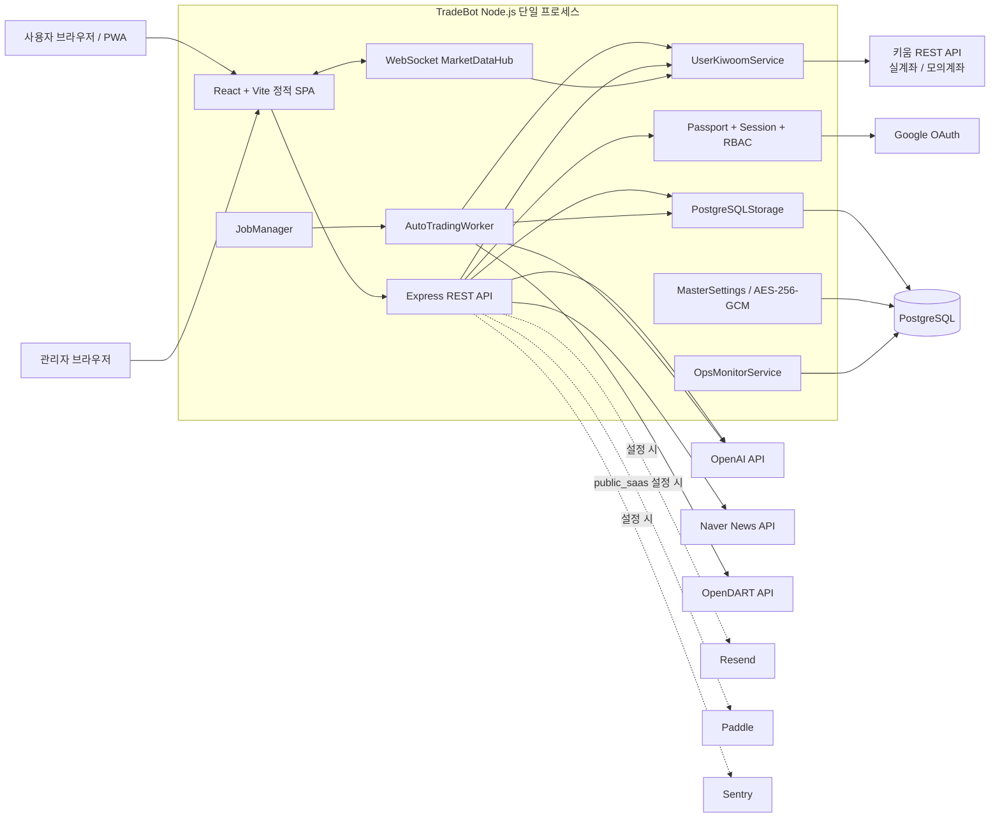
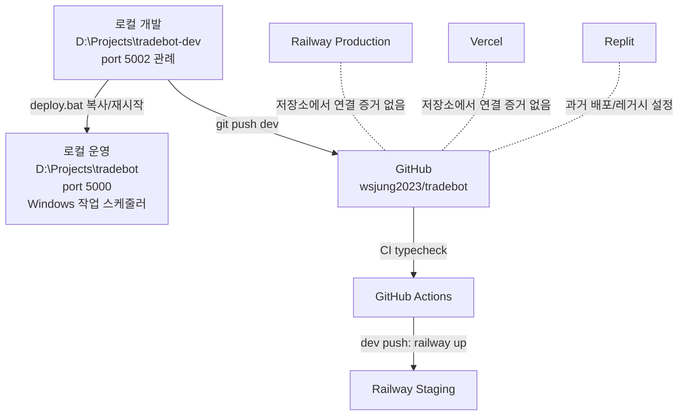
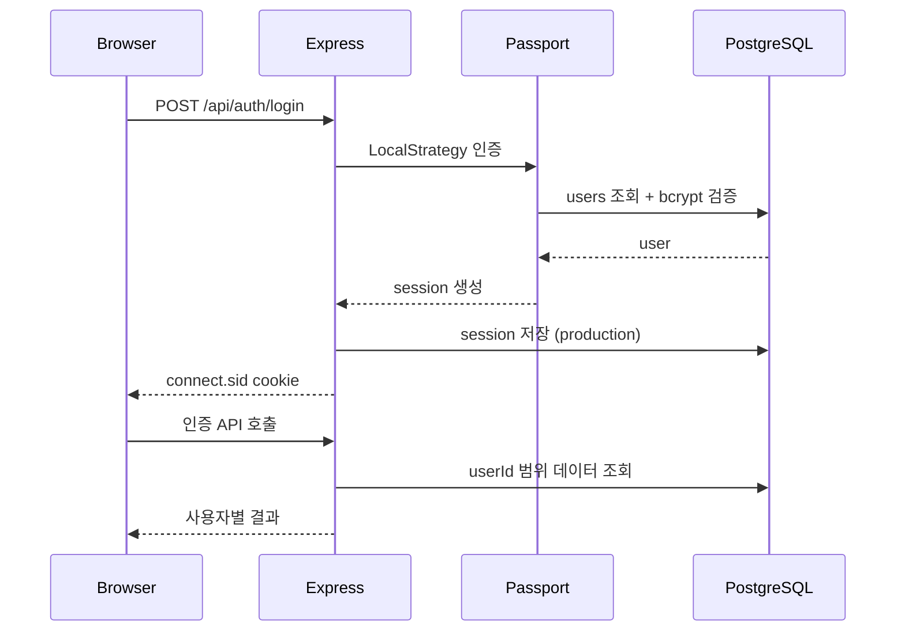
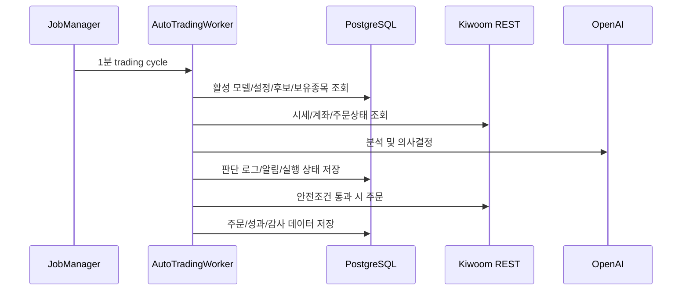
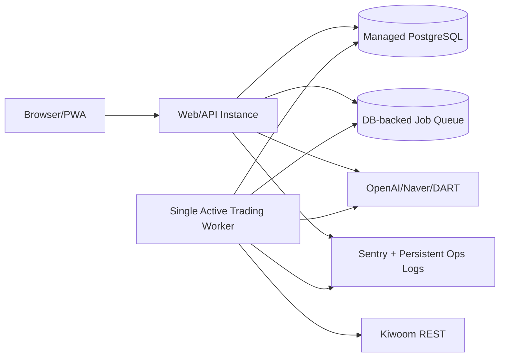

# TradeBot 현재 시스템 아키텍처

> 분석 기준일: 2026-06-14  
> 분석 기준 브랜치: `dev`  
> 분석 범위: 애플리케이션 코드, 설정, 배포 스크립트, Git 이력, 로컬 `.env`의 키 존재 여부  
> 주의: 비밀값 자체와 외부 서비스 콘솔 내부 상태는 확인하지 않았다.

## 1. 한 줄 요약

TradeBot은 React/Vite 웹 UI, Express API 서버, 서버 내부 자동매매 워커, PostgreSQL을 하나의 Node.js 프로세스에 묶은 멀티 사용자형 자동매매 애플리케이션이다. 현재 주력 키움 연동은 사용자별 암호화 API 키를 이용한 서버 직접 REST 호출 방식이며, 과거의 집 PC 폴링 에이전트 구조는 레거시 코드로 남아 있다.

## 2. 시스템 규모

| 항목 | 현재 규모 |
|---|---:|
| 프론트엔드 페이지 | 26개 |
| API 라우트 선언 | 151개 |
| PostgreSQL 테이블 | 46개 |
| SQL 마이그레이션 | 14개 (`0000`~`0013`) |
| 서버 Job | 6개 |
| 주 언어 | TypeScript, React, 일부 Python/PowerShell/Batch |

## 3. 현재 논리 아키텍처

## 4. 물리 배포 구조

### 4.1 현재 확인되는 배포선

### 4.2 실행 단위

- 개발: `npm run dev`가 `tsx --env-file=.env server/index.ts`를 실행한다.
- 프로덕션 빌드: Vite가 `dist/public`을 만들고 esbuild가 `server/index.ts`를 `dist/index.js`로 번들링한다.
- Railway 시작: `node scripts/migrate-prod.mjs && node dist/index.js`.
- 로컬 운영 배포: `deploy.bat`가 dev 소스를 `D:\Projects\tradebot`으로 복사하고 `TradeBot-Server` 작업 스케줄러를 재시작한다.
- 프론트엔드는 별도 Vercel 앱이 아니라 Express가 같은 프로세스에서 정적 파일로 서비스한다.

## 5. 애플리케이션 계층

### 5.1 프론트엔드

| 영역 | 구현 |
|---|---|
| 프레임워크 | React 18, Vite 5, TypeScript |
| 라우팅 | Wouter |
| 서버 상태 | TanStack React Query |
| UI | Tailwind CSS, Radix UI, Recharts |
| 실시간 | `/ws/market` WebSocket |
| PWA | manifest + service worker |
| 인증 흐름 | `/api/auth/me` 기반 ProtectedRoute |

주요 화면은 대시보드, 계좌, 수동 거래, 포트폴리오, AI 분석, 자동매매, 조건검색, 무지개 차트, 학습 제안, 모니터링, 관리자 Job/사용자 관리다.

### 5.2 API 서버

| 영역 | 구현 |
|---|---|
| 프레임워크 | Express 4 |
| 인증 | Passport Local + Google OAuth |
| 세션 | express-session, 프로덕션 PostgreSQL 세션 저장 |
| 보안 | Helmet, CORS allowlist, API/Auth rate limit |
| API 구조 | 기능별 `server/routes/*.routes.ts` |
| 정적 서비스 | 프로덕션에서 `dist/public` 제공 |
| 오류 추적 | `SENTRY_DSN` 설정 시 서버 오류 전송 |

라우트 그룹:

- 인증/온보딩/회원탈퇴
- 계좌/잔고/보유종목
- 주문/거래내역/매매일지
- AI 분석/AI 사용량/AI Council
- 조건검색/차트 수식/무지개 차트
- 자동매매/후보종목/매도계획/학습 제안
- 구독/결제
- 운영 모니터링/관리자 Job/사용자 관리

### 5.3 자동매매 및 백그라운드 Job

| Job | 기본 주기 | 기본 상태 | 역할 |
|---|---|---|---|
| `scan` | 30분 | 실행 | 활성 모델별 조건검색 후 후보종목 저장 |
| `auto-trading` | 1분 | 실행 | 후보 평가, 매수/매도 판단 및 주문 |
| `learning` | 매일 16:00 | 실행 | 거래 성과 기반 파라미터 학습/제안 |
| `balance-refresh` | 5분 | 실행 | 장중 활성 계좌 잔고/보유종목 동기화 |
| `exit-plan` | 매일 08:50 | 중지 | 보유종목별 AI 분할매도 계획 생성 |
| `ops-monitor` | 15초 | 실행 | DB, HTTP, AI, Job 상태 관측 |

Job 실행 상태와 주기는 DB `system_config`에 일부 영속화되지만, Job 스케줄러와 실행 잠금은 프로세스 메모리에 있다.

### 5.4 키움 연동

현재 활성 경로:

1. 사용자가 계좌별 키움 App Key/Secret을 등록한다.
2. 서버가 AES-256-GCM으로 암호화해 PostgreSQL에 저장한다.
3. `UserKiwoomService`가 사용자 또는 계좌별 `KiwoomService`를 생성하고 캐시한다.
4. 서버가 `api.kiwoom.com` 또는 `mockapi.kiwoom.com`을 직접 호출한다.
5. 토큰은 메모리와 `.kiwoom_token_cache.json`에 캐시된다.

레거시 경로:

- `agent.py`, `server/routes/kiwoom-jobs.routes.ts`, `kiwoom_jobs` 테이블이 남아 있다.
- `kiwoom-jobs.routes.ts`는 현재 `registerRoutes()`에 등록되지 않는다.
- `agent-proxy.service.ts`는 `AgentTimeoutError`만 남은 stub이다.
- `agent-direct.service.ts`는 현재 호출처가 없다.

따라서 제품 설명에서 “집 PC 에이전트 필수”라고 안내하면 현재 코드와 맞지 않는다.

### 5.5 AI 및 분석 재료

| 기능 | 외부 서비스 | 상태 |
|---|---|---|
| 종목/포트폴리오 분석 | OpenAI API | 구현 및 로컬 키 설정 |
| AI Council | OpenAI API | 구현, 기능 플래그 기본 OFF |
| 고급 학습 | 내부 학습 서비스 + OpenAI | 구현, 기본 ON |
| 뉴스 | Naver Search API | 구현 및 로컬 키 설정 |
| 공시/재무 | OpenDART API | 구현 및 로컬 키 설정 |
| 키움 재무/시세 | Kiwoom REST API | 구현 및 로컬 키 설정 |

## 6. 핵심 데이터 흐름

### 6.1 로그인 및 사용자 격리

대부분의 비즈니스 데이터는 `userId` 또는 사용자가 소유한 `accountId`/`modelId`를 통해 분리된다. 별도 tenant/organization 계층은 없다.

### 6.2 자동매매

### 6.3 실시간 화면

브라우저가 세션 인증된 `/ws/market` 연결을 열고 종목을 구독한다. `MarketDataHub`는 2초 간격으로 사용자별 키움 REST 시세/호가를 조회해 WebSocket으로 전달한다. 키움 WebSocket을 직접 중계하는 구조는 아니다.

## 7. 데이터베이스 도메인

| 도메인 | 주요 테이블 |
|---|---|
| 인증/사용자 | `users`, `session`, `user_settings`, `audit_logs` |
| 계좌/거래 | `kiwoom_accounts`, `holdings`, `orders`, `trading_logs`, `trade_journal`, `asset_snapshots` |
| AI 모델/분석 | `ai_models`, `ai_model_specs`, `ai_recommendations`, `ai_council_sessions`, `ai_usage_daily` |
| 자동매매 | `auto_trading_settings`, `auto_trading_runs`, `candidate_stocks`, `candidate_decision_logs`, `position_decision_logs`, `holding_exit_plans` |
| 학습/성과 | `learning_records`, `learning_suggestions`, `trading_performance` |
| 조건/차트 | `condition_formulas`, `condition_results`, `condition_scan_logs`, `chart_formulas`, `watchlist_signals`, `entry_points` |
| 시장 재료 | `financial_snapshots`, `market_issues`, `company_filings`, `news_articles`, `analysis_material_snapshots`, `stock_status` |
| 운영 | `system_config`, `engine_notifications`, `agent_update_logs`, `agent_alert_logs`, `kiwoom_jobs` |
| SaaS | `plans`, `subscriptions` |

## 8. 배포 티어 설계

코드는 `DEPLOYMENT_TIER` 하나로 세 제품 형태를 지원하도록 설계되어 있다.

| 값 | 의도 | 현재 동작 |
|---|---|---|
| `on_prem` | 고객 또는 운영자 PC 직접 설치 | 결제/플랜 제한 우회 |
| `private_cloud` | 고객별 전용 Railway 인스턴스 | 결제/플랜 제한 우회 |
| `public_saas` | 공용 멀티 사용자 SaaS | 구독/플랜 로직 활성화 |

로컬 `.env`에는 `DEPLOYMENT_TIER`가 없어 기본값 `on_prem`으로 동작한다.

## 9. 현재 아키텍처의 중요한 제약

### P0: 출시 전에 반드시 처리

1. `/api/master-settings`가 관리자 전용이라는 주석과 달리 인증/관리자 미들웨어 없이 공개되어 있다. 누구나 마스터 OpenAI/DART/키움 키를 덮어쓸 수 있다.
2. 로컬에 `RESEND_API_KEY`가 없고 신규 로컬 사용자는 이메일 인증 전 로그인이 차단된다. 현재 흐름에서는 인증 메일이 발송되지 않으면 신규 가입자가 로그인할 수 없다.
3. `Paddle` 코드는 있으나 로컬 설정이 없고, `requirePlan`/`checkModelLimit`이 실제 라우트에서 사용되지 않는다. 현재 public SaaS 플랜 제한은 실질적으로 집행되지 않는다.
4. Job과 자동매매 워커가 프로세스 내부 스케줄러다. Railway 복제본을 2개 이상 실행하면 같은 주문 사이클이 중복 실행될 수 있다.
5. 키움 토큰 캐시가 로컬 파일이다. Railway의 임시 파일시스템 또는 다중 인스턴스에서 일관성이 없다.

### P1: 운영 안정화 전에 처리

1. `NODE_ENV`가 로컬 `.env`에 없어 `npm run dev`에서는 development지만 다른 실행 방식에서는 의도치 않게 development 기본값이 적용될 수 있다.
2. `ALLOWED_ORIGINS`가 비어 있어 실제 Railway/커스텀 도메인 브라우저 요청이 차단될 수 있다.
3. Sentry는 서버 오류 핸들러만 연결되어 있고 클라이언트/자동매매 세부 오류 수집은 제한적이다.
4. Ops 모니터의 이력과 anomaly는 메모리에만 있어 재시작 시 사라진다.
5. Google OAuth만 Strategy가 설정된다. Kakao/Naver 라우트는 남아 있지만 Strategy가 없어 호출 시 오류 가능성이 있다.
6. `server/services/kiwoom`이 실제로 `kiwoom_OLD` 구현을 재수출해 디렉터리 이름과 실제 역할이 어긋난다.
7. DB 읽기/쓰기 풀 최대 연결 수가 합계 8개라 초기 규모에는 적합하지만 사용자 증가 시 병목이 될 수 있다.

## 10. 권장 목표 아키텍처

제품 초기에는 복잡한 마이크로서비스보다 현재 구조를 유지하되, 웹/API와 거래 워커의 실행 책임을 분리하는 것이 적절하다.

권장 원칙:

- 웹/API는 필요 시 수평 확장 가능하게 만든다.
- 거래 워커는 고객/환경당 단일 활성 인스턴스로 제한한다.
- Job claim과 주문 idempotency를 DB에서 보장한다.
- 키움 토큰은 DB 또는 전용 캐시에 암호화 저장한다.
- Public SaaS는 결제보다 먼저 플랜 제한과 사용자 데이터 접근 검증을 완성한다.
- 첫 판매 버전은 `private_cloud` 또는 관리형 `on_prem`이 가장 현실적이다.

## 11. 주요 소스 위치

| 역할 | 파일 |
|---|---|
| 서버 엔트리포인트 | `server/index.ts` |
| 라우트 조립 | `server/routes/index.ts` |
| 프론트 라우팅 | `client/src/App.tsx` |
| DB 스키마 | `shared/schema.ts` |
| DB 연결 | `server/db.ts` |
| 저장소 계층 | `server/storage/` |
| 자동매매 워커 | `server/auto-trading-worker.ts` |
| Job 관리자 | `server/job-manager.ts` |
| 사용자별 키움 서비스 | `server/services/user-kiwoom.service.ts` |
| 키움 REST 구현 | `server/services/kiwoom_OLD/` |
| AI 서비스 | `server/services/ai.service.ts` |
| 학습 서비스 | `server/services/learning.service.ts` |
| 주문 실행 | `server/services/trade-executor.service.ts` |
| 운영 모니터 | `server/services/ops-monitor.service.ts` |
| 배포 설정 | `railway.toml`, `.github/workflows/` |
| 로컬 운영 배포 | `deploy.bat`, `install.ps1` |
