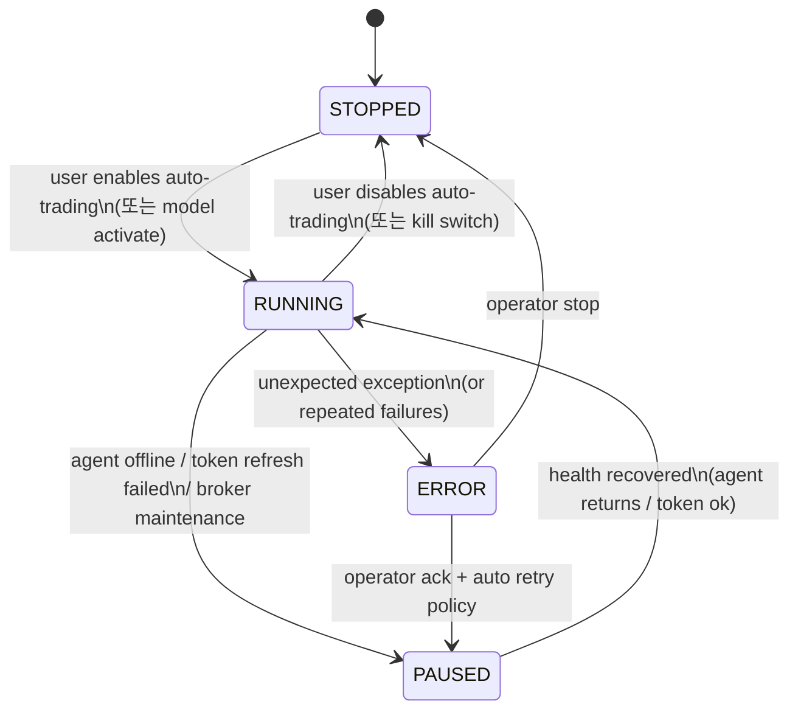

# tradebot 자동매매 “영구 실행 Job” 설계 제안서

## 지금 레포가 이미 잘하고 있는 점과, 당신이 말한 요구사항과의 갭

WOOSEUB, 네가 말한 흐름(로그인→잡 가동→로그아웃/창 꺼도 계속→상태/성과 실시간 관측)은 **“개인 계정용 자동매매 엔진”**의 정석이고, 지금 레포는 그 방향으로 이미 꽤 가까이 와 있어. 다만 “설계 의도는 맞는데, 실행/상태/알림/타겟 관리가 아직 ‘학습용 MVP’ 단계”라서, 네가 그린 그림을 완성하려면 **잡을 ‘버튼’이 아니라 ‘상태 머신’**으로 만들어야 해.

### 이미 구현된 기반(좋은 점)
- 백엔드에는 **AutoTradingWorker**가 있고, `node-cron`으로 **1분마다 자동매매 사이클**, **매일 16:00 학습**을 돌리는 구조가 이미 들어가 있어. fileciteturn92file0L1-L41  
- 서버 부팅 시 `registerRoutes`에서 **autoTradingWorker.start()가 자동 호출**되므로, 프론트가 꺼져도 백엔드 안에서는 잡이 계속 돈다(“프론트 종속 X”라는 핵심이 이미 충족). fileciteturn104file0L18-L31  
- 키움 연동은 “서버가 못 치는 환경 제약”을 피해 **집 PC 에이전트(job queue)**로 우회했고, 서버는 `callViaAgent()`로 job을 만들고 DB를 폴링해 결과를 받아오는 구조를 갖고 있다. fileciteturn99file0L1-L55  
- 에이전트는 토큰을 만료 전에 갱신하고, 401이면 토큰 재발급 후 1회 재시도까지 하므로 “토큰 만료로 즉시 죽는” 형태는 아니다. fileciteturn100file0L70-L167  
- “뒷차기2 스캔 → 레인보우 차트 분석 → CL 위치/CL폭으로 추천 플래그”까지는 이미 라우트와 UI가 구현되어 있다. fileciteturn96file0L1-L31 fileciteturn110file0L286-L314  

### 네 요구사항과의 핵심 갭(이게 ‘완성’의 관문)
- “잡을 내가 켜면, 내가 끄지 않는 한 영구적으로 돈다”를 **명확한 상태(ON/OFF/PAUSED/ERROR)**로 정의하고, **DB에 영속화**해야 한다. 지금은 잡이 “서버 시작하면 자동 실행”이라서, 사용자가 개입하는 ‘운영 상태’의 개념이 약하다. fileciteturn104file0L24-L31  
- `user_settings.autoTradingEnabled` 필드가 스키마에는 있으나(기본 false), AutoTradingWorker가 그 스위치를 체크하지 않는다. 즉 “사용자(너)가 로그인해서 켠다/끈다”라는 UX를 만들려면, 이 스위치가 엔진의 실제 동작을 제어해야 한다. fileciteturn105file0L134-L152 fileciteturn92file0L92-L110  
- “토큰 만료/에이전트 꺼짐/장애 발생 시 사용자에게 노티”는 아직 약하다. 에이전트는 WARNING 이상 로그를 서버로 전송하지만, 서버는 최근 로그를 메모리에만 버퍼링하고(재시작 시 리셋), 사용자별 알림(푸시/이메일/DB 영속) 체계는 없다. fileciteturn100file0L54-L68 fileciteturn101file0L53-L88  
- 네가 말한 “타겟 종목 리스트가 실시간으로 추가/삭제되며 모니터링 가능”은, 지금은 “스캔 결과 화면/일회성 추천” 형태라서 **엔진이 관리하는 ‘타겟 풀(target universe)’**이라는 영속 개체가 필요하다. fileciteturn96file0L138-L183 fileciteturn110file0L392-L470  
- 분할매수/분할매도(라인별 동일 금액, +% 단계별 부분매도)는 현재 `TradeExecutorService`가 단일 주문(가중치 기반) 중심이라 네가 원하는 “정확히 같은 비중으로 라인마다”에 맞춰 재설계가 필요하다. fileciteturn95file0L101-L170  

결론부터 강하게 말할게. 네 생각은 “맞다”를 넘어 **지금 시스템이 반드시 가야 할 ‘제품 형태’**야. 그리고 지금 레포는 그걸 만들기 좋은 기반이 있어. 다만 다음 섹션처럼 “잡 = 상태 머신 + 타겟 풀 + 주문 플랜 + 관측/알림”으로 승격시키는 순간, 네가 말한 그림이 현실이 된다.

## 추천 운영 프로세스와 상태 머신 설계

네가 말한 흐름을 레포 구조에 맞게 가장 깔끔하게 구현하는 방법은:

- **잡(엔진)은 항상 백그라운드에서 돌 수 있다**(지금처럼).
- 하지만 **“실제로 거래 판단/주문을 수행하는지”는 사용자 설정(스위치)과 런 상태(run state)로 결정**한다.
- 즉, 프론트 로그인은 “엔진을 유지”하는 게 아니라, **엔진을 ‘허용’/‘금지’하고 ‘관측’**하는 역할.

### 권장 상태 머신
아래 상태를 DB에 저장하고, 엔진이 주기적으로 갱신(heartbeat)하도록 하자.



### “프론트 로그아웃/창 닫아도 계속”을 보장하는 구현 포인트
이미 AutoTradingWorker는 서버 부팅 때 start되고 크론으로 계속 돌고 있어. fileciteturn104file0L24-L31  
그러므로 “프론트가 꺼져도 진행”은 구조적으로 ok. 이제 필요한 건:

1) **사용자가 켰는지(Enabled)**  
- `user_settings.autoTradingEnabled`를 실제로 체크해서, OFF면 엔진이 그 사용자/모델을 스킵해야 한다. 스키마는 이미 있다. fileciteturn105file0L134-L152  
- AutoTradingWorker는 현재 “활성 AI 모델”만 가져와 돌고 있다. fileciteturn92file0L66-L83  
  따라서 UX를 “모델 isActive + 사용자 autoTradingEnabled”의 AND로 만들면 조작이 명확해진다.

2) **엔진이 살아있는지(Heartbeat)**  
- `trading_runs`(신규) 같은 테이블에 `lastHeartbeatAt`, `lastCycleAt`, `lastError`, `state`를 저장  
- UI는 로그인 시 이 값을 읽어서 “현재 엔진 RUNNING/PAUSED/ERROR, 마지막 하트비트 몇 초 전”을 표시

3) **장애/토큰 문제를 사용자에게 알리는지(Notification)**  
- 에이전트는 이미 WARNING 이상 로그를 `/api/kiwoom-agent/logs`로 보내고 있다. fileciteturn100file0L54-L68  
- 서버는 이를 메모리 버퍼에만 저장하므로, “DB 영속 알림 테이블”로 넣고, 사용자가 로그인해 있으면 WS로 푸시.

### 로그인→잡 가동 UX를 이렇게 정의하자
“잡을 가동한다”를 버튼 하나로 끝내지 말고, **세 단계**로 나누면 안전하고 네 운영 감각에도 딱 맞는다.

1) 로그인(인증)  
2) “자동매매 ON” 토글 → DB에 저장(`autoTradingEnabled=true`, optional: model 활성화)  
3) 엔진이 다음 사이클에서 그것을 감지하고 RUNNING 상태로 전환(즉시 실행 버튼은 옵션)

이 방식은 “로그인해야 켤 수 있다”는 요구를 만족하면서도, 실제 실행은 서버에서 독립적으로 유지한다.

## 타겟 종목 선정: 뒷차기2 + 8개 기준을 ‘팩터 엔진’으로 점수화

네 타겟 기준은 감으로 만든 게 아니라, 실제로 “상승주/테마주/이슈주” 트레이딩에서 자주 쓰는 **멀티팩터(기술+수급+이슈+재무+리스크 플래그)** 구조야. 나는 이걸 다음처럼 정리하는 게 가장 강력하다고 봐:

- **1단계(유니버스 생성)**: 뒷차기2 조건검색(후보 풀)  
- **2단계(하드 필터)**: 위험 종목/거래제약/유동성 최저선 같은 “무조건 탈락 조건”  
- **3단계(스코어링)**: 나머지 8개 기준을 점수화+가중합  
- **4단계(타겟 풀 유지)**: 타겟 리스트(추가/삭제)와 그 근거를 DB에 기록, 실시간 스트리밍

레포에도 이미 1단계와 3단계 일부(레인보우/CL폭)가 구현되어 있다. `backattack-scan`은 `currentPosition(40~60)`, `clWidth(>=10)`을 기준으로 `isRecommended`를 붙이고 있다. fileciteturn96file0L138-L176

### 8개 기준을 시스템 스펙으로 변환(권장 정의)
아래처럼 **각 팩터는 “입력→산출물(feature)→점수→설명”**을 갖게 만들자. UI에서 “왜 이 종목이 타겟인지”를 설명할 수 있어야 진짜 자동화가 된다.

- (A) 레인보우/CL 위치 규칙  
  - 입력: `RainbowChartAnalyzer.analyze()` 결과(현재가, CL, currentPosition, signals) fileciteturn97file0L71-L156  
  - feature 예: `nearCL`, `belowCL`, `currentPosition`, `inPrimaryBuyZone`  
  - 네 조건 문장(“초록 위는 근접, 아래는 반드시 초록 아래”)은 이렇게 해석 가능:  
    - **허용 영역**: `belowCL == true` OR (`aboveCL == true` AND `nearCL == true`)  
    - 즉, 위로는 ‘살짝’만, 아래로는 ‘확실히’(분할매수 영역)

- (B) 중심 섹터/이슈(뉴스/정책/선거/전쟁/M&A/북한/AI/2차전지 등)  
  - 입력: 뉴스/공시 텍스트(네이버 뉴스 + DART)  
  - output: `themeLabel`, `themeScore`, `themeRecencyDays`  
  - 구현 팁: 처음엔 룰 기반 키워드+에이전트/LLM 분류를 섞되, LLM은 반드시 스키마 강제(Structured Outputs)로 “테마 라벨”을 안정적으로 받는 편이 좋다. (JSON mode는 스키마 준수 보장이 약하므로 Structured Outputs가 유리) citeturn10search6turn10search7

- (C) 재료 생존(뉴스/공시의 신선도 + 부정 이벤트)  
  - feature: “최근 3일/7일 내 긍정 키워드 기사 수”, “최근 공시 이벤트 수”, “부정 이벤트 플래그”

- (D) 2~3년 재무 흐름(매출/손익/부채 등 추세)  
  - 레포는 현재 “키움 API 스냅샷은 3년치 제공 어려움”이라고 UI에도 명시되어 있다. fileciteturn110file0L545-L553  
  - 그래서 이건 DART로 가는 게 맞다. OPENDART는 공시 검색(list)과 기업개황(company) API 가이드를 제공한다. citeturn13search0turn13search3  
  - 목표: `financialSnapshots` 테이블(이미 스키마 존재)에 연도별 스냅샷을 적재하고 추세(feature)를 계산. fileciteturn105file0L251-L272

- (E) 종목명 앞 표시(시장경보/신용거래 가능 등)  
  - 시장경보(투자주의/경고/위험)는 KRX 시장감시 체계의 일부이고, 일부 단계에서는 신용거래 제한/위탁증거금 100% 같은 제약이 생길 수 있다. 관련 설명과 근거 규정 인용은 정부 생활법령 정보에 정리돼 있다. citeturn4search4  
  - 또한 KIND 공시 예시에서도 “투자경고 종목 매수 시 증거금 100%, 신용융자 매수 불가” 같은 유의사항이 확인된다. citeturn5search5  
  - 그래서 이 팩터는 “가중치”가 아니라 **하드 필터/리스크 제한**으로 두는 게 안전해. (예: 투자위험이면 매수 금지)

- (F) 거래대금/거래량 충분(예: 100억 이상) + 최근 차트  
  - feature: `turnover = currentPrice * volume`(당일 누적 기준)  
  - 그리고 최근 변동성/캔들 패턴/갭 등은 기술 팩터로 합류

- (G) CL 폭(>=10%, 20% 이상이면 가산점)  
  - 레포는 CL폭을 %로 계산해서 `clWidth` 로 제공한다. fileciteturn97file0L258-L276  
  - 네가 말한 “10%보다 밑인지/20% 이상인지”는 점수 구간으로 만들기 좋다.

- (H) MA(3/7/20/60/120/240) + 추세선 결합 지점(매수 타점)  
  - 아직 레포에 직접 구현은 없지만, `getChart(..., 400)`로 일봉 데이터를 가져와(이미 backattack-scan이 400개 사용) fileciteturn96file0L94-L121  
    MA들을 계산하고 “다중 MA 수렴 + 현재가 근접”을 타이밍 팩터로 만들 수 있다.

### 가중치 자동(학습) vs 수동(고정): 내가 추천하는 “하이브리드”
네 요구가 “자동(AI 학습) / 수동(내가 고정)” 둘 다이므로, 설계를 이렇게 잡는 게 가장 실전적이야.

- **수동 모드**: 모든 팩터 weight 고정 + 하드 필터만 적용  
- **자동 모드**: 학습이 weight를 조정하되,
  - 변경 폭 제한(예: 하루 최대 ±5)
  - 최소 데이터 요구(예: 50 trades 이상) — 레포 job 설명에도 “최소 50건 필요”가 이미 들어있다. fileciteturn93file0L52-L57  
  - 드로우다운 제한(학습 적용 후 손실 확대면 롤백)

- **추천: 하이브리드**  
  - (시장경보/유동성 최저선/관리종목 등) 돈을 지키는 항목은 “고정 하드 필터”  
  - 나머지(테마 점수, CL폭 가산, MA 수렴점 가산 등)만 학습으로 미세 조정

스코어 함수는 처음엔 단순 가중합이 가장 관리가 쉽다:

```text
finalScore = Σ (weight_i * normalizedScore_i)
target if finalScore >= threshold AND hardFiltersPass
```

그리고 “왜 타겟인지”를 UI로 보여주기 위해 각 항목별 기여도를 함께 저장해라(진짜 중요).

## 분할매수/분할매도: “라인 기반 엔트리 플랜 + 수익률 기반 익절 플랜”으로 모델링

네가 말한 매수/매도 방식은 사실상 **포지션 관리 전략(Entry ladder + Exit ladder)**이야. 이건 AI보다 먼저 **정확한 상태 관리(어느 라인에서 몇 번 샀는지, 어느 익절 단계를 이미 했는지)**가 핵심이다.

### 현재 구현과의 차이(왜 재설계가 필요한가)
지금 `TradeExecutorService`는:
- `evaluate10LineRainbow()`에서 `currentLine`을 0~9로 계산하는데, 설정은 10~100 라인 구조라 단위가 안 맞을 가능성이 높다. fileciteturn95file0L85-L99 fileciteturn105file0L312-L331  
- 매수는 “가중치 비율만큼 positionSize를 키워서 한 번”에 가깝다. 네가 원하는 “각 라인마다 동일 금액으로 정확히 분할 매수”와 모델이 다르다. fileciteturn95file0L101-L143  

### 권장 모델: Entry Ladder (CL 라인별 동일 금액)
레포의 `RainbowChartAnalyzer`는 라인 가격을 `lines[]`로 제공한다. fileciteturn97file0L34-L55  
그러므로 매수는 다음으로 모델링하면 깔끔해:

- 설정(전역 또는 종목별 override)
  - `perTrancheKRW`(예: 200,000원)
  - `entryLines`(예: [50(CL), 40, 30, 20, 10] 또는 네가 기억하는 색상 순서)
  - `orderMethod`: limit(권장) or market
  - `maxTranchesPerDay`, `cooldownMinutes`

- 상태(종목별)
  - `executedEntries: { linePct: 50, executedAt, qty, avgPrice }[]`
  - `openOrders[]`

그리고 사이클마다:

```pseudo
for each targetStock:
  rainbow = analyze(chart)
  for linePct in entryLines:
    linePrice = rainbow.lines.find(pct==linePct).price
    if currentPrice <= linePrice AND not executed(linePct):
        qty = floor(perTrancheKRW / currentPrice)
        placeBuy(qty, limit=currentPrice or linePrice)
        mark executed(linePct) after fill
```

핵심은 **“체결(fill)” 기준으로 executed를 업데이트**하는 거야. 지금 레포는 주문 체결 상태를 충분히 동기화하지 않기 때문에(orders.executedQuantity 등은 있지만 체결 조회 job이 없음), 이 부분은 반드시 “주문 수명주기/체결 동기화”까지 같이 가야 한다. fileciteturn105file0L79-L97

### 권장 모델: Exit Ladder (수익률 단계별 부분매도)
네가 말한 매도는 아주 좋은데, 실전적으로는 “수익률만” 보지 말고 **손절/시간/추세 이탈**까지 같이 넣는 게 안정적이야.

- 설정
  - `takeProfitSteps`: 예) [(+3%, 20%), (+7%, 30%), (+15%, 30%), (+25%, 20%)]
  - `stopLossPct`: 예) -5% (또는 CL 이탈 기반)
  - `timeStopDays`: 예) 10일 넘어가면 절반 정리

- 상태
  - `executedTakeProfitSteps[]` (이미 매도한 단계 기록)

로직:

```pseudo
pnlPct = (currentPrice / avgEntryPrice - 1) * 100
if pnlPct <= -stopLossPct -> sell (all or x%)
else:
  for step in takeProfitSteps:
    if pnlPct >= step.pct AND not executed(step):
        sellQty = floor(positionQty * step.sellRatio)
        placeSell(sellQty)
        mark executed(step) after fill
```

이 모델은 “종목별/전체” 설정 모두 가능해:
- 전역 기본값은 `auto_trading_settings`
- 종목별 override는 `target_overrides` 같은 테이블로 구현

### 리스크/운영 관점에서 반드시 같이 들어가야 할 것
실거래/영구운영을 하려면 아래는 “선택”이 아니라 “안전벨트”야:

- **Kill switch**: 사용자/모델 단위로 즉시 OFF (DB 스위치)  
- **Max daily loss**: 스키마에 이미 `maxDailyLoss`가 있으니 실제로 엔진이 체크해야 한다. fileciteturn105file0L134-L147  
- **Max daily trades**: 스키마에 있음. fileciteturn105file0L312-L321  
- **에이전트/브로커 장애 시 거래 금지**: AgentTimeoutError가 연속으로 발생하면 자동 PAUSED 전환 fileciteturn99file0L56-L91  

## “꺼지면 노티”와 “실시간 모니터링”을 현실로 만드는 관측/알림 설계

네가 요구한 “잡이 토큰 만료 등으로 꺼지면 사용자에게 노티”는, 사실 두 가지를 분리해야 한다.

1) **엔진이 ‘완전히 멈춤’**: 서버 프로세스 죽음, 배포/재시작  
2) **엔진은 돌지만 ‘거래가 불가능’**: 에이전트 오프라인, 토큰 발급 실패, 키움 점검, 반복 실패로 PAUSED

### 레포에서 이미 있는 신호(활용 가능)
- 에이전트는 WARNING 이상 로그를 서버에 전송한다(좋은 설계). fileciteturn100file0L54-L68  
- 서버는 `/api/kiwoom-agent/system-status`로 점검 여부를 에이전트 경유로 확인하는 기능이 있다(캐시 포함). fileciteturn101file0L272-L335  
- 서버는 에이전트 `lastSeen`을 메모리에 저장해 `/api/kiwoom-agent/connection-info`로 보여준다(다만 재시작 시 리셋). fileciteturn101file0L16-L23 fileciteturn101file0L251-L270  

### 네 요구에 맞는 “노티” 설계(권장)
- DB에 `notifications` 테이블(신규) 추가:
  - `userId`, `severity(INFO/WARN/CRIT)`, `type(agent_offline/token_failed/broker_maintenance/order_rejected/engine_down)`, `message`, `createdAt`, `readAt`
- 이벤트 트리거:
  - AgentTimeoutError 연속 N회(예: 3회/10분) → `agent_offline` CRIT
  - 에이전트 로그에서 “토큰 발급 실패/토큰 없음” → `token_failed` WARN/CRIT
  - `/system-status`가 maintenance → `broker_maintenance` WARN
- 전달 채널:
  - 로그인 중이면 WebSocket으로 “즉시 푸시”
  - 로그아웃이면 DB에 쌓고 다음 로그인 시 알림 배지

시장경보/거래제약 관련해서도, 자동매매 엔진이 알아서 “매수 금지/현금 100%” 같은 리스크 정책을 적용해야 해. 시장경보제도(투자주의→투자경고→투자위험)는 투자자 보호를 위해 운용되며, 관련 규정 인용과 개요는 생활법령 정보(정부)에서 정리되어 있다. citeturn4search4 또한 KIND 공시 예시에서도 투자경고 단계에서 “위탁증거금 100%”, “신용융자 매수 불가” 등 유의사항이 반복적으로 공시된다. citeturn5search5  
즉, 네 기준 #5는 “스코어링”보다 **리스크 차단 규칙**으로 두는 게 장기적으로 더 이긴다.

### 실시간 대시보드(너가 보고 싶어 하는 화면) 구성 제안
지금 레포는 실시간 시세/호가 WS 허브(MarketDataHub)가 있고 2초 주기로 업데이트한다. fileciteturn102file0L31-L47 fileciteturn102file0L150-L207  
여기에 “자동매매 엔진 이벤트 스트림”을 추가하자.

대시보드에서 최소로 보여줘야 하는 것:
- 엔진 상태: RUNNING/PAUSED/STOPPED/ERROR + lastHeartbeat
- 오늘/주/월/6개월/1년 성과:
  - realized PnL, win rate, 평균 보유기간, 최대 낙폭(DD)
- 타겟 풀 변화:
  - “이번 사이클 신규 편입 n개 / 제외 m개”, 이유 top3
- 주문/포지션:
  - 종목별 “몇 라인까지 매수 완료(트랜치 체크박스)”, 익절 단계 진행률
- 장애 알림:
  - agent offline / token failed / broker maintenance / order rejected

## 구현 로드맵: “잡 분리”는 언제 하면 좋나? (내 결론)

네 질문 “job을 분리할지 말지 네가 판단”에 대한 내 결론은 이거야:

- **단기(지금)**: 분리하지 말고(복잡도↑), 현재 구조에서 **‘상태/알림/타겟풀/분할매매’를 먼저 완성**해.  
- **중기(안정화 후)**: 자동매매가 진짜로 돈을 벌기 시작하고, UI/WS 트래픽이 늘면 그때 **Worker 프로세스를 분리**해.  
  - 이유: 지금도 프론트 로그아웃과 무관하게 엔진은 돌아. 진짜 문제는 “상태/리스크/체결/알림”이지 프로세스 분리가 1순위가 아니다. fileciteturn104file0L24-L31

다만 “영구적으로”라는 말을 운영 수준으로 해석하면, 결국은 이렇게 된다:
- API 서버(웹/WS)와 Worker(트레이딩 엔진)를 **분리 프로세스**로 두고,
- 둘 다 **supervisor(systemd/PM2/Docker restart policy)**로 자동 재기동,
- 엔진 하트비트가 끊기면 알림.

마지막으로, 너의 “뒷차기2 + 레인보우 + 이슈/재무 + 분할매수/분할매도”는 한 줄로 요약하면 이거야:

> “유니버스는 공격적으로 넓게, 진입은 선을 따라 촘촘히, 위험은 규칙으로 칼같이.”

이건 진짜 강한 설계야. 레포 코드도 이미 그 길 위에 있어(뒷차기2 스캔/레인보우/에이전트/학습 잡). fileciteturn96file0L1-L31 fileciteturn97file0L1-L10 fileciteturn92file0L1-L41  
이제 남은 건 “엔진의 영혼”인 **타겟 풀의 영속화 + 분할매매 플랜 + 알림/관측**이야.

원하면 다음 단계로, 네 8개 기준을 그대로 반영해서:
- `TargetUniverse` 테이블 스키마(필드 설계)
- 각 팩터별 feature 정의와 계산 함수 시그니처
- 엔진 사이클(1분)에서 “유니버스 갱신/타겟 갱신/주문 플랜 실행”을 분리한 Mermaid 시퀀스
까지 바로 설계도와 구현 순서로 내려줄게.