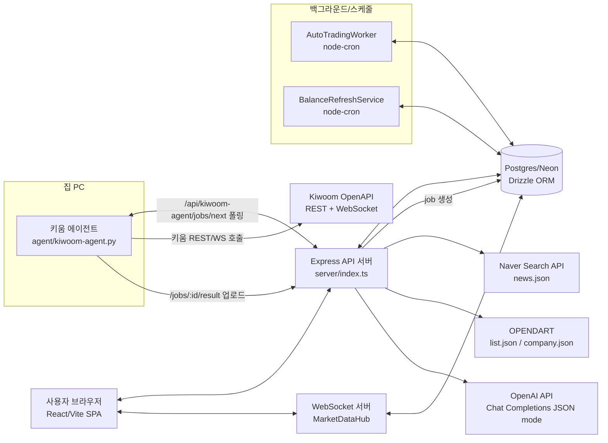
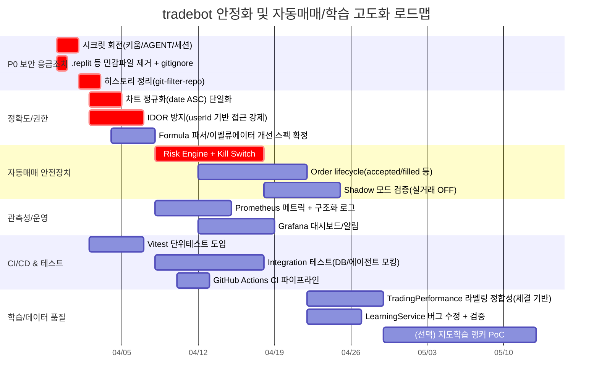

# wsjung2023/tradebot 전체 소스코드 분석 및 설계·문제 해결 제안 보고서

## Executive summary

이 저장소는 “자동매매 + AI 분석 + 키움 OpenAPI 연동 + (집 PC) 에이전트”를 한 몸에 묶어 둔 **풀스택 트레이딩 플랫폼**입니다. 프론트는 React/Vite, 백엔드는 Express(TypeScript), DB는 Postgres(Neon) + Drizzle ORM, 실시간은 `ws` 기반 WebSocket, 외부 연동은 **키움 REST/WS(에이전트 경유)**, **네이버 뉴스 검색 API**, **DART OpenAPI**, **OpenAI API**로 구성됩니다. 키움 연동은 “클라우드 서버 IP 제약”을 피하려고 **DB 기반 Job Queue + 폴링 에이전트(파이썬)**로 설계되어 있어 방향성은 좋습니다. (키움 REST는 운영 `api.kiwoom.com`, 모의 `mockapi.kiwoom.com`를 사용하며 OAuth2 토큰 발급 엔드포인트와 바디 구조가 문서로 명시되어 있습니다. citeturn11search0)

다만, 현재 상태로는 “학습용 자동매매 봇”을 완성하기 전에 반드시 해결해야 할 **치명 리스크(보안/정확도/운영)**가 동시에 존재합니다. 특히 아래 3가지는 “지금 당장” 급합니다.

첫째, **리포지토리에 비밀키(키움 AppKey/Secret 등)가 커밋된 정황**이 있습니다(`.replit`에 민감 값이 포함). 이 경우 원칙적으로 **유출로 간주하고 즉시 폐기/회전(rotate)**가 필요합니다. GitHub도 “커밋 히스토리에 들어간 시크릿은 먼저 revoke/rotate가 1순위”라고 명시합니다. citeturn14search0  
둘째, 백엔드에 **키움 자격증명을 클라이언트(브라우저)로 내려주는 엔드포인트**가 존재합니다(`/api/kiwoom/credentials`). 설계 의도가 “클라이언트 폴백”이라도, **Secret을 브라우저로 보내는 것은 구조적으로 위험**합니다(탈취 난이도 ↓).  
셋째, 시그널 계산에서 **차트 데이터 정렬(최신/과거 순)이 모듈마다 다르게 가정**되어 Rainbow/BackAttack 신호가 “상황에 따라 뒤집히는” 치명적 정확도 문제가 발생할 수 있습니다(일부는 reverse, 일부는 그대로).

이 보고서는 위 리스크를 포함해 **기능 버그, 보안 취약점, 성능/확장성 병목, 데이터 품질/라벨링, 모델 검증/드리프트, 리스크 관리/컴플라이언스, 운영/모니터링**을 전수 관점으로 정리하고, 각 이슈마다 **원인→영향→개선 설계/스펙→코드 레벨 변경(또는 의사코드)→테스트 전략→난이도/리스크→롤아웃/마이그레이션**까지 제시합니다. 마지막에 **Mermaid 다이어그램(아키텍처/데이터플로우/Gantt)**과 **대안 비교 테이블**, **Prometheus/Grafana 샘플 쿼리/알림 임계치**, **CI 파이프라인 스니펫**을 제공합니다.

---

## 현재 코드베이스 구조 및 핵심 모듈 맵

아래는 실제 코드에서 확인된 구조를 “학습 자동매매 봇 관점”으로 재정렬한 모듈 맵입니다(주요 파일/폴더명은 그대로).

```text
/
  client/                      # React SPA (wouter + react-query)
    src/
      App.tsx                  # ProtectedRoute + 페이지 라우팅
      lib/queryClient.ts       # fetch wrapper (cookie session)
      ...pages/*               # accounts, trading, ai-analysis, auto-trading 등
  server/
    index.ts                   # Express 부팅, 세션, 보안헤더, rate limit, 라우트, WS
    routes/
      auth.routes.ts           # register/login/logout + 소셜 OAuth 라우팅
      account.routes.ts        # 계좌/잔고 동기화/주문내역 + (위험) credentials 반환
      trading.routes.ts        # 시세/호가/차트 + 주문 프록시 + Rainbow chart
      watchlist.routes.ts      # 관심종목/알림/설정/시그널
      formula.routes.ts        # 차트 포뮬러 파싱/평가 + 조건검색 결과 저장
      ai.routes.ts             # 뉴스/재무/공시 수집 & GPT 분석 + 모델/학습기록
      autotrading.routes.ts    # BackAttack2 scan (조건검색→차트→Rainbow 분석)
      kiwoom-agent.routes.ts   # 에이전트 job queue API (polling, result upload)
      admin.routes.ts          # 잡 시작/중지/즉시실행 (권한모델 약함)
      settings.routes.ts       # server public IP 조회
      rainbow.ts               # Rainbow 분석 전용 라우터
    services/
      agent-proxy.service.ts   # job 생성→DB 폴링→done/error/timeout
      user-kiwoom.service.ts   # agent 우선 + legacy fallback + 정규화
      balance-refresh.service.ts # 5분마다 실계좌 잔고 자동갱신(cron)
      ai.service.ts            # OpenAI Chat Completions(JSON mode)
      ai-council.service.ts    # “3인 위원회” (현재 persona 힌트 미반영)
      learning.service.ts      # tradingPerformance 기반 파라미터 최적화(버그 존재)
      trade-executor.service.ts # “매수/매도 실행” 핵심(리스크 엔진 미흡, 버그 존재)
      dart.service.ts          # OPENDART list/company 연동
      news.service.ts          # 네이버 뉴스 검색 API + 룰 기반 감성
      kiwoom_OLD/*             # server에서 직접 Kiwoom REST/WS 호출(토큰 파일 캐시)
    storage/
      interface.ts             # IStorage
      postgres-core.storage.ts # 대부분의 CRUD (권한체크 책임 다소 분산)
      postgres.storage.ts
    formula/
      rainbow-chart.ts         # BackAttack Line(“레인보우”) 지표 계산
    utils/
      crypto.ts                # AES-256-GCM + PBKDF2
      balance-parser.ts        # 잔고 보유종목 필드명 정규화
      market-hours.ts          # KST 장시간(휴장일 미반영)
  shared/
    schema.ts                  # Drizzle tables + zod schema (대규모)
  agent/
    kiwoom-agent.py            # 집 PC 에이전트 (REST + WebSocket 조건검색 포함)
    start-agent.bat
  scripts/
    test-balance-parser.mjs    # 회귀 테스트(수동 실행)
    playwright-smoke.mjs
    replit-readiness.mjs
  drizzle.config.ts
  package.json
  .replit                      # ⚠️ 현재 커밋된 민감정보(키/시크릿) 존재 정황
```

**현재 구현이 “실전 자동매매 봇”이 아니라 “플랫폼”에 가깝다는 점**이 오히려 장점입니다. 즉, WOOSEUB님의 고유 전략(예: BackAttackLine/조건검색)을 “엔진화”하기 좋습니다. 다만, 그만큼 **권한/보안/운영 안정성**을 제대로 잡아야 “돈이 걸린 자동화”로 넘어갈 수 있습니다. (여기서부터는 ‘멋있음’보다 ‘안전함’이 우선입니다. 진짜로요.)

---

## 아키텍처와 데이터 흐름

### 개략 아키텍처



키움 REST는 OAuth2 토큰 발급을 통해 접근하며(운영/모의 도메인 분리), 바디에 `grant_type=client_credentials`, `appkey`, `secretkey`를 넣는 방식이 공식 문서에 명시되어 있습니다. citeturn11search0  
뉴스는 네이버 검색 API의 `news.json`을 사용하고, 헤더에 `X-Naver-Client-Id`, `X-Naver-Client-Secret`을 넣는 방식이 공식 문서에 명시되어 있습니다. citeturn12search0  
공시는 OPENDART의 `list.json`(공시검색)과 `company.json`(기업개황)을 사용하며, 요청 변수가 개발가이드에 정리되어 있습니다. citeturn13search0turn13search3  
OpenAI는 Chat Completions JSON mode에서 `response_format: { "type": "json_object" }`를 사용할 수 있고, JSON 출력 지시가 컨텍스트에 필요하다는 점이 공식 도움말에 명시되어 있습니다. citeturn10search6

### 에이전트 Job flow

현재 구현의 핵심은 “서버가 키움 API를 직접 못 치는 상황(고정 IP/단말 등록 제약)”을 우회하기 위한 **Job Queue**입니다.

```mermaid
sequenceDiagram
  autonumber
  participant C as Client(브라우저)
  participant S as Server(Express)
  participant D as DB(Postgres)
  participant A as Agent(집 PC)
  participant K as Kiwoom(OpenAPI)

  C->>S: GET /api/trading/price?stockCode=...
  S->>D: INSERT kiwoom_jobs(status=pending, payload)
  loop polling(서버 내부)
    S->>D: SELECT kiwoom_jobs WHERE id=...
    D-->>S: status=pending/processing/done/error
  end

  loop agent polling(2초)
    A->>S: GET /api/kiwoom-agent/jobs/next (AGENT_KEY)
    S->>D: SELECT next pending job; UPDATE status=processing
    D-->>S: job assigned
    S-->>A: jobType + payload
  end

  A->>K: REST/WS 호출
  K-->>A: 응답 데이터
  A->>S: POST /api/kiwoom-agent/jobs/:id/result (done/error)
  S->>D: UPDATE kiwoom_jobs(status, result/error)
  D-->>S: updated
  S-->>C: 응답 반환(또는 timeout)
```

이 구조는 “단말 등록/네트워크 제약이 강한 브로커 API”에서 자주 쓰는 패턴이라서 방향성은 좋습니다. 다만, 지금 구현은 **DB 폴링**이어서 부하/지연/관측성 측면에서 한계가 있고, 보안(AGENT_KEY/권한), 정확도(차트 정렬), 안정성(타임아웃/재시도/멱등성) 개선이 필요합니다.

---

## 주요 문제 진단

아래 표는 **전수 관점에서 발견된 핵심 이슈**를 “치명도/우선순위” 중심으로 압축한 목록입니다. (각 이슈는 표 아래에 **원인→영향→개선안→테스트→난이도/리스크→롤아웃** 형태로 바로 이어집니다.)

### 이슈 요약 테이블

| 우선 | 범주 | 이슈(요약) | 근본 원인 | 영향 | 권장 조치 | 작업/리스크 |
|---|---|---|---|---|---|---|
| P0 | Security | **리포지토리에 키/시크릿 커밋 정황(.replit)** | 시크릿을 코드/설정 파일로 트래킹 | 키 탈취→계정/거래 악용 가능 | 즉시 **키 폐기/회전 + 히스토리 제거** | Effort: Med / Risk: High |
| P0 | Security | **/api/kiwoom/credentials가 appSecret을 브라우저로 전송** | “클라이언트 폴백” 설계 | 세션 탈취/확장프로그램/로그로 유출 | 엔드포인트 제거, 서버/에이전트만 사용 | Low / High |
| P0 | Correctness | **차트 데이터 정렬 가정 불일치**(reverse 여부 제각각) | 모듈마다 “최신순” 가정 다름 | 시그널/학습/주문 판단이 뒤집힘 | 단일 정규화 함수로 강제 | Med / High |
| P1 | AuthZ | **IDOR(소유권 검증 누락)**(watchlist delete, alert delete, ai recommendations 등) | delete/update를 id만으로 처리 | 타 사용자 데이터 삭제/열람 가능 | 스토리지/라우트에 userId 필수화 | Med / High |
| P1 | Trading Risk | **리스크 엔진 부재**(손실제한/포지션한도/킬스위치/주문수명주기) | “주문 실행”이 단순 호출 | 오주문/과매매/손실폭발 | Pre-trade risk gate + circuit breaker | High / High |
| P1 | Reliability | **Agent-proxy DB polling** + MarketDataHub의 job 폭증 가능 | 600ms 폴링 + 2초 주기 WS 업데이트 | DB/에이전트 병목·타임아웃 | 캐시/배치/멱등키 + 이벤트화 | Med~High / Med |
| P1 | AI Quality | **JSON 모드만 사용(스키마 불일치 가능)** | `json_object`는 “유효 JSON”만 보장 | 파싱 성공해도 필드 누락/오판 | Structured Outputs(JSON schema) 도입 | Med / Med citeturn10search6turn10search7turn10search9 |
| P2 | Bug | Formula parser가 `<=` 등 연산자 토큰화 불가 + valuewhen 의미 오류 | 단순 tokenizer/상태 없는 evaluator | 수식 신뢰도 붕괴 | 파서 전면 교체/테스트 강화 | High / Med |
| P2 | Bug | AI Council persona 힌트가 실제 프롬프트에 반영되지 않음 | `reasoningHint` 무시 | “위원회”가 사실상 복제 | AIService 입력 스키마 개선 | Med / Low |
| P2 | Bug | LearningService가 hasGoodFinancials/hasHighLiquidity를 잘못 참조 | entryConditions 중첩 구조 | 학습 최적화가 엉뚱한 결론 | 경로 수정 + 회귀테스트 | Low / Med |
| P2 | Operability | 모니터링/알림/감사로그 체계 미흡 | 관측성 설계 부재 | 장애/오주문 탐지 지연 | Prometheus+Grafana+Structured logs | Med / Med |

---

### P0-1. 리포지토리 시크릿 커밋 정황(.replit)

**Root cause**  
`.replit` 파일이 버전관리 대상이 되었고, 그 안에 키움 키/시크릿 등 민감정보가 포함된 정황이 확인됩니다(값 자체는 본 보고서에 재노출하지 않음).

**Impact**  
시크릿이 커밋 히스토리에 들어가면 “삭제”보다 먼저 **폐기/회전(rotate)**가 1순위입니다. GitHub 공식 문서도 “시크릿이라면 첫 단계는 revoke/rotate”라고 명시합니다. citeturn14search0  
특히 금융/거래와 연결된 키는 악용 시 금전 피해로 직결될 수 있어 P0입니다.

**Remediation plan (우선순위 포함)**  
1) **즉시(오늘)**: 키움 AppKey/Secret, AGENT_KEY, 세션 시크릿 등 “커밋된 적 있는 모든 시크릿”을 **폐기/재발급**  
2) **즉시**: `.replit` 및 기타 시크릿 파일을 `.gitignore`에 추가하고, Replit/배포 환경에서는 “Secrets/Environment Variables”로만 주입  
3) **단기(1~2일)**: GitHub 히스토리에서 시크릿 제거(필요 시 `git-filter-repo`) + 협업자 클론 정리  
4) **중기**: gitleaks/git-secrets + GitHub Secret Scanning/Push protection 활성화(조직/레포 설정)

**Code-level changes / commands** (예시)  
```bash
# 1) .gitignore에 추가
echo ".replit" >> .gitignore
echo ".env" >> .gitignore
echo ".kiwoom_token_cache.json" >> .gitignore

# 2) (필요 시) git-filter-repo로 히스토리에서 .replit 제거
# GitHub 문서: remove-sensitive-data (절차/부작용 설명) 참고 citeturn14search0
git filter-repo --sensitive-data-removal --invert-paths --path .replit

# 3) 강제 푸시(주의: 협업자 클론 정리 필요)
git push --force --mirror origin
```

**Testing strategy**  
- “테스트”라기보다 **검증**: 신규 커밋에서 시크릿 패턴이 잡히는지(gitleaks), 배포 환경에서 앱이 정상 부팅하는지(ENV 주입) 확인.

**Estimated effort / risk**  
- Effort: Medium (히스토리 rewrite 포함 시)  
- Risk: High (실수하면 재오염 가능, 협업자/포크/캐시 문제) citeturn14search0

**Rollout plan / migration**  
- 키 회전 → 앱 재배포 → 에이전트 `.env` 갱신 → 정상 호출 확인 → 마지막으로 히스토리 정리(필요 시).

---

### P0-2. /api/kiwoom/credentials가 Secret을 브라우저로 전송

**Root cause**  
`server/routes/account.routes.ts`에 “클라이언트 폴백용 자격증명 제공” 엔드포인트가 존재합니다. 브라우저는 본질적으로 “비밀을 지킬 수 없는 환경”인데 Secret을 보내는 구조입니다.

**Impact**  
- XSS/확장프로그램/프록시/로그로 Secret이 유출될 수 있고, 유출되면 거래 API 악용 가능  
- 세션 기반 인증이 깨지면 “키까지 같이 털리는” 최악 경로가 열림

**Remediation plan**  
- **즉시 제거**: `/api/kiwoom/credentials` 엔드포인트 삭제  
- 폴백이 필요했다면, 폴백은 “브라우저”가 아니라 **서버(또는 집 PC 에이전트)**에서 수행  
- 반드시 “서버 내부”에서만 Kiwoom AppSecret을 사용하도록 강제

**Code-level change (예시)**  
```ts
// server/routes/account.routes.ts
// DELETE ENTIRE ROUTE: GET /api/kiwoom/credentials
// 대체: 서버→에이전트 방식만 유지하거나,
// 필요 시 "서버 프록시"로만 제공(브라우저는 키를 받지 않음)
```

**Testing strategy**  
- API 계약 테스트: `/api/kiwoom/credentials`가 404/410을 반환하는지  
- E2E: 잔고조회/주문이 “에이전트 경유”로 정상 동작하는지

**Effort / risk / rollout**  
- Effort: Low, Risk: Medium(일부 UI에서 폴백을 기대할 수 있음)  
- 롤아웃: 서버 배포 → 클라이언트에서 해당 기능 호출부 제거 → 안내 문구(“집 PC 에이전트를 사용하세요”) 표시.

---

### P0-3. 차트 데이터 정렬(시간축) 불일치로 인한 시그널 왜곡

**Root cause**  
- `trading.routes.ts`의 Rainbow 계산에서는 “키움 차트 데이터가 최신순”이라는 전제 하에 `reverse()`로 과거→현재 순 정렬을 맞춘 흔적이 있습니다.  
- 하지만 `autotrading.routes.ts`, `routes/rainbow.ts`, `TradeExecutorService` 등 다른 경로에서는 reverse 없이 그대로 분석합니다.  
- 에이전트(`handle_chart_get`) 역시 “원본 API 응답 순서”를 그대로 반환합니다.

**Impact**  
- 동일 종목/동일 시점인데도 **엔드포인트/기능에 따라 추천이 달라지는** 현상  
- 학습(TradingPerformance) 데이터가 잘못 쌓이면 이후 최적화가 오염  
- 실거래 연동 시, 잘못된 신호로 매수/매도 트리거

**Remediation plan**  
- **단 하나의 정규화 함수**로 “차트 배열은 항상 `date ASC`(과거→현재)”를 강제  
- `UserKiwoomService.getChart()` 단계에서 강제 정렬하고, 하위 모듈은 이를 신뢰  
- 날짜 파싱 실패 시 fallback(숫자 비교/문자열 YYYYMMDD 비교)

**Code-level changes (예시)**  
```ts
// server/services/user-kiwoom.service.ts
function normalizeChart(items: Array<{date: string}>) {
  return [...items].sort((a,b) => (a.date || "").localeCompare(b.date || ""));
}

async getChart(userId: string, stockCode: string, period="D", count=100) {
  const raw = await callViaAgent(...);  // 기존 유지
  const normalized = normalizeChart(raw); // <-- 추가
  return normalized;
}
```

**Testing strategy**  
- 단위 테스트: “입력 데이터가 최신순/랜덤순이어도 normalize 후 date ASC가 되는지”  
- 회귀 테스트: 같은 종목에 대해 `/api/trading/rainbow-lines`, `/api/rainbow/analyze`, `/api/auto-trading/backattack-scan` 결과의 핵심 지표(CL, currentPosition)가 일관되는지

**Effort / risk / rollout**  
- Effort: Medium, Risk: High(기존 결과와 달라질 수 있으나, “이전이 틀린” 가능성이 큼)  
- 롤아웃: 1) normalize 도입 + 로그로 기존/신규 비교 2) Canary(일부 요청만) 3) 전체 전환.

---

### P1. IDOR(소유권 검증 누락) 및 권한 모델 약함

**Root cause**  
몇몇 delete/read API가 “id만”으로 DB 작업을 수행하고, userId 소유권을 검증하지 않습니다(예: watchlist 삭제, alert 삭제, ai recommendations 조회 등). 또한 admin 잡 제어 역시 “로그인 여부”만 보며 admin role이 없습니다.

**Impact**  
멀티유저 환경이 되면 **타 사용자 데이터 삭제/열람**이 가능해집니다(단일 운영계정만 쓰더라도, 미래 확장성에 치명적 부채).

**Remediation plan**  
- 모든 “개별 리소스 접근”은 **(userId, resourceId)** 쌍으로 조회 후 처리  
- Storage 레벨 API를 `deleteWatchlistItem(userId, id)`처럼 바꾸고, SQL where에 userId를 포함  
- 관리자 기능은 `isAdmin` role(또는 allowlist)을 userSettings/user table에 추가해 통제

**Code-level changes (예시)**  
```ts
// server/routes/watchlist.routes.ts
app.delete("/api/watchlist/:id", isAuthenticated, async (req,res)=>{
  const userId = getCurrentUser(req)!.id;
  const id = Number(req.params.id);

  const item = await storage.getWatchlistItemById(id);
  if (!item || item.userId !== userId) return res.status(404).json({error:"not found"});
  await storage.deleteWatchlistItem(id);
  res.json({message:"deleted"});
});

// 더 좋은 방식: storage.deleteWatchlistItem(userId, id)로 강제
```

**Testing strategy**  
- 통합 테스트: User A로 생성한 watchlist/alert를 User B가 삭제 시도하면 404/403  
- DB 레벨: 가능하면 RLS(Row Level Security) 고려(다만 앱 구조 단순성 vs 운영 난이도 트레이드오프)

**Effort / risk / rollout**  
- Effort: Medium, Risk: High(보안 이슈)  
- 롤아웃: Storage 인터페이스 변경은 연쇄 수정이 필요하므로 “단계적”: 1) 라우트에서 선검증 2) Storage 시그니처 변경 3) DB 제약 강화.

---

### P1. 자동매매 리스크 관리/주문 수명주기 부재

**Root cause**  
`TradeExecutorService`는 “신호가 buy/sell이면 주문”으로 직진하며, 실전 시스템에 필요한 최소 안전장치(일 손실 제한, 일 거래 횟수 제한, 동일 종목 중복 진입 방지, 슬리피지/체결 확인, 킬 스위치, 롤백/재시도 정책)가 없습니다. 또한 Rainbow “10라인” 계산에서 line 스케일 버그(0~9) 가능성이 있고, 설정(`rainbowLineSettings`)을 실제로 사용하지 않습니다.

**Impact**  
- 오주문/과매매/폭주(특히 장중 반복 크론)  
- 체결 확인 없이 “성공한 것처럼 DB 기록”이 쌓여 학습 데이터 오염  
- 운영자가 중지해야 할 상황에서 중지 수단 부족

**Remediation plan (핵심 설계)**  
- **Risk Gate(사전 체크)**: 주문 전 반드시 통과해야 하는 규칙 집합  
  - 계좌 모드(mock/real) + feature flag + “킬스위치”  
  - 일 손실 한도(예: -2%), 일 주문 수, 종목당 포지션 한도  
  - 동일 종목 “쿨다운”(예: 30분 내 재진입 금지)  
  - 잔고/가용현금 확인(에이전트 `balance.get` 기반)  
- **Order lifecycle**: `created → submitted → accepted → filled/partial → canceled/rejected`  
  - 최소한 submitted/accepted/failed는 구분 저장  
- **멱등성 키**: (modelId, accountId, stockCode, side, minuteBucket) 조합으로 중복 주문 방지  
- **체결 기반 라벨링**: learning 데이터는 “체결가/체결시간” 기반으로만 생성

**Code-level pseudocode (Risk Gate)**  
```ts
// trade-executor.service.ts (개념 의사코드)
const decision = {side:"buy", qty, price, reason, score...};

const risk = await riskEngine.check({
  userId, accountId, decision,
  equity: await accountState.getEquity(),
  openOrders: await storage.getOpenOrders(accountId),
  positions: await storage.getHoldings(accountId),
  limits: settings.riskLimits,
});

if (!risk.allowed) {
  await storage.writeTradeLog({decision, risk, status:"blocked"});
  return;
}

const orderId = await storage.createOrder({...status:"submitted", idempotencyKey});
const brokerResp = await kiwoom.placeOrder(...);

await storage.updateOrder(orderId, {status:"accepted", brokerOrderNo: brokerResp...});
```

**Testing strategy**  
- 단위: riskEngine 규칙(일손실/쿨다운/중복/포지션 한도)을 케이스 기반으로 검증  
- 통합: “같은 조건으로 1분 내 5번 호출”해도 주문이 1개만 생성되는지(idempotency)  
- E2E(모의): 크론 3회 실행 시나리오에서 주문/로그/성과데이터가 일관되는지

**Effort / risk / rollout**  
- Effort: High, Risk: High(실거래로 가는 관문)  
- 롤아웃:  
  1) mock 계좌에서만 riskEngine ON  
  2) “실거래”는 킬스위치 + 일손실 0원(=실행 금지) 상태로 배포  
  3) 운영 대시보드/알림 준비 후 제한적으로 해제.

---

### P1. Agent-proxy/MarketDataHub 성능·확장성 병목

**Root cause**  
- `agent-proxy.service.ts`는 job 생성 후 600ms 간격으로 DB를 계속 폴링합니다.  
- `MarketDataHub`는 2초마다 사용자별/심볼별로 `getPrice/getOrderbook`를 호출하고, 이는 (기본적으로) 매번 새로운 job을 만들 수 있습니다. “심볼 수 × 사용자 수”가 커지면 DB/job 테이블이 병목이 됩니다.

**Impact**  
- DB connection/CPU 상승 → API 지연, 타임아웃  
- 에이전트가 job 처리 속도를 못 따라가면 backlog가 누적  
- 실시간 화면이 많은 사용자(혹은 탭 여러 개)에서 급격히 불안정

**Remediation plan**  
- **1차(저비용)**: `callViaAgent()`에 dedupeKey를 적극 활용(이미 구조는 존재) → 심볼/채널별 멱등화  
- **2차**: 가격/호가를 “심볼 단건 호출” 대신 “watchlist.get(batch)”로 묶어서 job 수를 줄임  
- **3차(중기)**: DB 폴링을 이벤트 기반으로(예: Postgres LISTEN/NOTIFY, 혹은 Redis pub/sub)  
- **4차(운영)**: job 테이블 정리(TTL), 인덱스, 상태별 partial index

**Testing strategy**  
- 부하 테스트: 1 user가 50 symbols 구독 시 job 생성률/대기시간이 임계치 이하인지  
- 회귀: dedupe 적용 후 UI 업데이트 빈도 유지 여부

**Effort / risk / rollout**  
- Effort: Med(1~2차), High(3차 이벤트화)  
- 롤아웃: dedupe → batch → 이벤트화 순으로 단계.

---

### P1-P2. AI 출력 안정성(스키마 보장) 및 AI Council 품질

**Root cause**  
AIService가 JSON mode를 사용하지만, JSON mode는 “유효 JSON”만 보장하고 스키마 일치를 보장하지 않습니다. citeturn10search6  
또한 OpenAI는 Structured Outputs(JSON schema + strict)를 제공하며, 스키마 준수를 강하게 보장하는 방향을 공식적으로 소개합니다. citeturn10search7turn10search9  
현재 AI Council은 persona role을 넘기려 하지만 `reasoningHint`가 실제 프롬프트에 포함되지 않아 “3명”이 사실상 비슷한 답을 만들 수 있습니다.

**Impact**  
- `action/confidence/targetPrice` 누락/형식 오류 → 자동매매 판단 오류  
- Council 기능이 “그럴듯하지만 비싼 복제”가 됨(비용↑, 효용↓)

**Remediation plan**  
- AI 분석 응답을 Structured Outputs로 스키마 강제(가능 모델 기준)  
- 스키마 검증 실패 시 retry(최대 1~2회), 그래도 실패하면 “hold + 낮은 confidence”로 fail-safe  
- Council: analyst persona를 system message에 분리 주입(technical/fundamental/sentiment) + 입력 데이터도 분화(차트/재무/뉴스 요약)

**Code-level change (개념)**  
```ts
// ai.service.ts (개념)
// response_format: json_schema + strict true (Structured Outputs) 사용
// 공식 소개 참고 citeturn10search7turn10search9

// + Zod로 최종 검증 후 저장/거래 판단에 사용
```

**Testing strategy**  
- 계약 테스트: AI 응답이 항상 스키마 필수 필드를 만족하는지  
- 비용/지연: 샘플 100회 실행에서 평균 토큰/지연 측정 후 캐시 전략(재료 스냅샷) 적용

**Effort / risk / rollout**  
- Effort: Medium, Risk: Medium  
- 롤아웃: 분석 API부터 적용 → 자동매매는 “hold-only shadow”에서 검증 → 실거래 판단 적용.

---

## 개선 설계 및 구현 제안

### 핵심 목표 정의

WOOSEUB님의 목표(“고유 전략 + AI 결합 자동매매 봇 완성”)를 달성하려면, 코드베이스를 다음 3층으로 분리하는 설계가 가장 안전하고 빠릅니다.

1) **Execution Layer(브로커 실행/데이터 수집)**  
- 키움 호출(시세/차트/조건검색/주문/잔고)은 “한 경로”로 통일: **집 PC 에이전트 경유**  
- 서버는 오직 “정책/검증/기록/오케스트레이션” 담당

2) **Decision Layer(전략/AI 판단)**  
- 전략 엔진(BackAttackLine, 조건식, 포뮬러)은 deterministic(재현 가능)  
- AI는 “보조 시그널/리스크 감지/요약”로 점진적으로 확장(초기엔 shadow)

3) **Learning Layer(라벨링/평가/개선)**  
- 학습은 우선 “파라미터 최적화”가 아니라, **데이터 품질(정렬/체결/라벨)**부터  
- 목표는 “모델 드리프트/성능 저하를 감지하고 롤백 가능한” 구조

### 설계 선택에 필요한 가정(미정 항목)

| 항목(미정) | 선택지 | 설계에 미치는 영향 |
|---|---|---|
| 목표 배포 환경 | Replit 유지 vs Docker(Cloud Run/ECS) vs K8s | 고정 IP/관측성/비용/운영 난이도 결정 |
| 사용자 수/QPS | 1인(개인) vs 소수 팀 vs 다중 사용자 | IDOR/권한모델, Rate limit, WS 스케일링 요구치 |
| 데이터 규모 | 일봉 400개 수준 vs 분봉/틱 | Postgres만으로 충분한지(시계열DB/컬럼DB 필요) |
| 실거래 여부 | mock-only vs 실거래 | 리스크 엔진/감사로그/킬스위치/컴플라이언스 강도 |
| AI 비용 한도 | 낮음 vs 중간 vs 높음 | 재료 스냅샷/캐시/모델 선택/빈도 제한 정책 |

### 대안 비교 테이블

**모델/의사결정 방식 비교**

| 접근 | 장점 | 단점 | 추천 상황 | 비용/복잡도 |
|---|---|---|---|---|
| 규칙 기반(현재 Rainbow/조건식 중심) | 재현성↑, 디버깅 쉬움, 비용↓ | 시장 변화 대응 약함 | 초기 실거래 진입/안전성 | Low |
| 규칙 + LLM(현재 방향) | 근거 요약/뉴스 해석/리스크 코멘트 강점 | hallucination/일관성 이슈 → 스키마 강제가 중요 citeturn10search6turn10search7 | “고유 전략”을 유지하며 AI 보강 | Med |
| 지도학습 랭커(XGBoost/LightGBM) | 라벨 기반 예측 안정, 빠른 추론 | 라벨링/데이터 품질이 관건 | 데이터가 쌓였을 때(수백~수천 트레이드) | Med~High |
| 딥러닝 시계열(Transformer 등) | 비선형 패턴 학습 가능 | 데이터/검증/드리프트 관리가 매우 어려움 | 연구/확장 단계 | High |
| 강화학습(RL) | 정책최적화 목표에 이론적 적합 | 실제 시장에선 위험/검증 난이도 최고 | 장기 R&D | Very High |

**데이터 저장소 옵션(현행 Postgres 기준)**

| 옵션 | 장점 | 단점 | 적용 추천 |
|---|---|---|---|
| Postgres(현행) | 트랜잭션/정합성, 운영 단순 | 대규모 시계열엔 비효율 | 현행 유지 + 인덱싱/TTL |
| TimescaleDB | 시계열 최적화 | 운영 복잡도 증가 | 분봉/틱 확장 시 |
| Redis 캐시 | 실시간 캐시/큐에 강함 | 영속성/정합성 별도 설계 | MarketDataHub 병목 완화 |
| 오브젝트 스토리지(S3 등) | 원천데이터 저장 저렴 | 쿼리/조인 불편 | 데이터 레이크/학습 원천 |

**배포 옵션**

| 옵션 | 장점 | 단점 | 코멘트 |
|---|---|---|---|
| Replit(현행) | 개발/배포 빠름 | 고정 IP/운영 통제가 제한적 | 개인 MVP엔 OK, 실거래엔 보강 필요 |
| Docker + Cloud Run/ECS | 표준 운영 | 설정/관측성 필요 | 장기적으로 추천 |
| K8s | 확장/관측성 최고 | 운영 난이도 최고 | 다중 사용자/고QPS일 때만 |

### 구현 로드맵 Mermaid Gantt

아래는 “2026-03-30 시작” 가정의 권장 일정입니다(실거래 연결은 마지막 단계로 미루고, 그 전까지는 shadow/mock로 안전하게 굴립니다).



---

## 운영·보안·CI/CD·모니터링 체계

### 보안 하드닝 체크리스트

- **시크릿 관리**: 코드/레포에 절대 저장하지 말고, 배포 플랫폼 Secret store로 주입. 커밋된 시크릿은 rotate가 1순위이며, 필요 시 히스토리 제거는 추가 조치입니다. citeturn14search0  
- **세션 시크릿 강제**: `SESSION_SECRET` 미설정 시 부팅 실패(현재는 development-secret 폴백 가능성이 있음)  
- **AGENT_KEY 강화**: 길이/형식 강제(최소 32바이트), 주기적 교체, 에이전트 엔드포인트 rate limit  
- **권한 모델**: admin 잡 제어는 role 기반으로 제한(로그인만으로는 부족)  
- **의존성 점검**: `npm audit` + Dependabot, 특히 인증/세션/암호/네트워크 라이브러리 우선  
- **민감 로그 방지**: 에이전트 로그 업로드 시 token/appSecret 등이 절대 찍히지 않도록 필터링(정규식 마스킹)

### 추천 메트릭과 대시보드(핵심 패널)

**API/서버**
- `http_requests_total{route,method,status}`  
- `http_request_duration_seconds_bucket{route}` (p50/p95/p99)  
- `db_query_duration_seconds_bucket{query}`

**에이전트/잡 큐**
- `agent_jobs_created_total{jobType}`  
- `agent_jobs_inflight`(pending+processing)  
- `agent_job_latency_seconds_bucket{jobType}` (created→done)  
- `agent_job_timeouts_total{jobType}`

**자동매매**
- `autotrade_cycle_duration_seconds`  
- `autotrade_decisions_total{action=buy|sell|hold,reason}`  
- `orders_submitted_total{side}` / `orders_rejected_total{reason}`  
- `daily_pnl` / `drawdown_pct`

### 알림 임계치(샘플)

- 에이전트 미접속: `agent_last_seen_seconds > 60` → WARNING, `> 300` → CRITICAL  
- job backlog: `agent_jobs_inflight > 100`(개인) / `> 1000`(다중)  
- timeout rate: `rate(agent_job_timeouts_total[5m]) > 0.05 * rate(agent_jobs_created_total[5m])`  
- 자동매매 위험: `daily_drawdown_pct > 2` → 자동매매 즉시 OFF(킬스위치)

### Prometheus/Grafana PromQL 예시

```promql
# 5분 평균 API 에러율(5xx)
sum(rate(http_requests_total{status=~"5.."}[5m])) / sum(rate(http_requests_total[5m]))

# jobType별 평균 처리시간(5분)
histogram_quantile(0.95, sum(rate(agent_job_latency_seconds_bucket[5m])) by (le, jobType))

# 에이전트 타임아웃 급증 감지
rate(agent_job_timeouts_total[5m]) > 1
```

### 구조화 로그 포맷(권장)

```json
{
  "ts": "2026-03-29T12:34:56.789Z",
  "level": "INFO",
  "service": "tradebot-api",
  "requestId": "01H...",
  "userId": "uuid-or-null",
  "route": "/api/trading/price",
  "method": "GET",
  "status": 200,
  "latencyMs": 123,
  "msg": "request completed",
  "meta": {
    "stockCode": "005930",
    "agent": { "jobType": "price.get", "jobId": 1234 }
  }
}
```

### 샘플 CI 파이프라인(GitHub Actions)

아래는 “현재 scripts + TypeScript + Vite + Playwright” 구성을 감안한 최소 CI 예시입니다(레포에 `.github/workflows/ci.yml` 추가).

```yaml
name: ci
on:
  push:
  pull_request:

jobs:
  build-test:
    runs-on: ubuntu-latest
    steps:
      - uses: actions/checkout@v4

      - uses: actions/setup-node@v4
        with:
          node-version: "20"
          cache: "npm"

      - run: npm ci

      - name: Type check
        run: npm run check

      - name: Build
        run: npm run build

      # 빠른 회귀(현재 존재하는 테스트 스크립트)
      - name: Balance parser regression
        run: node scripts/test-balance-parser.mjs

      # 선택: Playwright는 브라우저 설치 필요
      - name: Install Playwright
        run: npx playwright install --with-deps chromium

      - name: Playwright smoke
        run: npm run test:playwright
```

### 외부 연동(키움/네이버/DART/OpenAI) 운영 팁

- 키움 토큰 발급/도메인/바디 구조는 공식 가이드에 맞춰 엄격히 관리하고(운영/모의 분리), citeturn11search0  
  “조건검색(WebSocket)”처럼 오래 걸리는 작업은 timeout/재시도/관측성을 강화해야 합니다(현재 에이전트는 PING/REAL 수집까지 구현되어 있어 기반은 좋음).
- 네이버 뉴스 검색 API는 호출 한도(일 25,000회) 및 요청 헤더 요구사항이 공식 문서에 있습니다. 캐시(TTL) 정책은 필수입니다. citeturn12search0  
- OPENDART `list.json`은 corp_code 미지정 시 기간 제한(3개월) 등 제약이 있어, corp_code 캐시 전략이 중요합니다(현재 DartService는 corpCodeCache를 구현). citeturn13search0  
- OpenAI JSON mode는 “JSON을 생성하라”는 지시가 컨텍스트에 없으면 문제를 일으킬 수 있고, 스키마 일치는 보장하지 않습니다. Structured Outputs 도입이 안정성 레버리지입니다. citeturn10search6turn10search7turn10search9

---

### 마지막 한 문장(강한 의견, 하지만 응원)

이 레포는 “이미 반 이상 만들어진 조종석”입니다. 다만 지금은 **안전벨트(시크릿/권한/리스크/정렬/관측성)**가 느슨해서, 엔진을 더 세게 돌릴수록 위험이 커져요. 안전벨트부터 조여 놓으면, WOOSEUB님의 고유 전략은 AI와 만나서 훨씬 더 멀리—그리고 더 오래—달릴 수 있습니다.